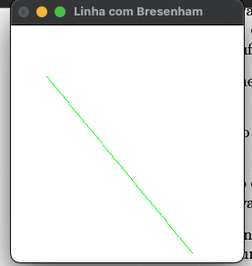
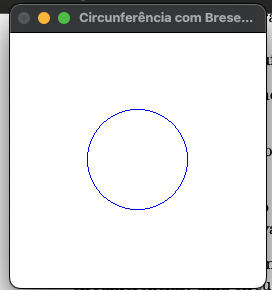
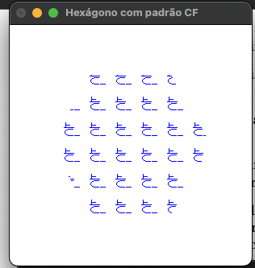
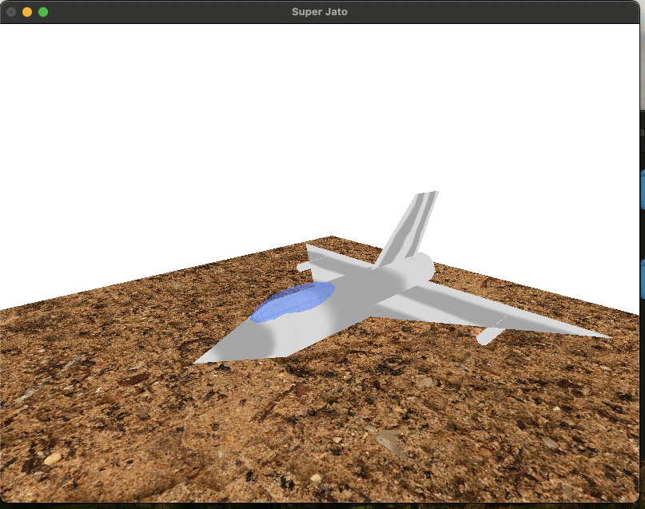

= Lista de Exercicios - Computação Gráfica
Maria Clara Moura de Freitas (202300) <maria.clarafreitas@hotmail.com>
:toc:
:icons: font
:url-quickref: https://docs.asciidoctor.org/asciidoc/latest/syntax-quick-reference/

Essa página detalha os exercícios realizados para a matéria de Computação Gráfica na UFRN em 2025.1. Foi utilizado OpenGL e para rodar os códigos em algumas máquinas é necessário a instalação de algumas coisas, assim como, em alguns códigos vão usar alguma extensão a mais que precisa ser instalada. Para facilitar a execução foi utilizado o makefile disponibilizado pelo professor adaptado para rodar em um sistema MacOS, assim como, os headers dos codigos. Todos os códigos estão disponiveis em meu github [link] e todos os exercicios estão localizados na pagina pessoal do professor [link]

== Capítulo 2
Para começarmos, testamos o codigo disponibilizado pelo professor para preparar todo o ambiente de execução para todas as atividades que serão realizadas. O código disponibilizado se chama teste-make.c

```
[teste-make.c]
/* programa teste-make.c */

#include <GLUT/glut.h>
#include <stdlib.h>
#include <stdio.h>

void display(void);
void timer(int);
void keyboard(unsigned char key, int x, int y);

/* cores do quadrado */
GLfloat r=1.0, g=0.5, b=0.0;

int main(int argc, char** argv){
  glutInit(&argc, argv);
  glutInitDisplayMode (GLUT_SINGLE | GLUT_RGB);
  glutInitWindowSize (256, 256); 
  glutInitWindowPosition (100, 100); 
  glutCreateWindow (argv[0]);
  // inicia um temporizador. após 33ms ativa a funcao timer
  glutTimerFunc(33, timer, 1);
  glClearColor(1.0, 1.0, 1.0, 0.0);
  glShadeModel (GL_FLAT);
  glOrtho (0, 1, 0, 1, -1 ,1);
  glutDisplayFunc(display);
  glutMainLoop();
  return 0;
}

void timer(int value){
  r=r+0.01;
  g=g+0.01;
  b=b+0.01;
  if(r>1) r=0;
  if(g>1) g=0;
  if(b>1) b=0;
  glutPostRedisplay();
  glutTimerFunc(33, timer, 1);
}

void display(void){
  int i;
  glClear(GL_COLOR_BUFFER_BIT);
  glColor3f (r, g, b);
  glBegin(GL_POLYGON);
  glVertex2f(0.25,0.25);
  glVertex2f(0.75,0.25);
  glVertex2f(0.75,0.75);
  glVertex2f(0.25,0.75);
  glEnd();
  glFlush();
}
```
Assim como, um programa make tambem foi disponibilizado para deixar as execuçoes mais rapidas (adaptei para funcionar em Macos)

```
[Makefile]
# Makefile portátil para programas OpenGL com GLUT em C e C++
# Uso: make nome-do-arquivo (sem extensão)

# Detecta o sistema operacional
UNAME_S := $(shell uname -s)

# Compiladores padrão
CC = gcc
CXX = g++
CFLAGS = -O2
CXXFLAGS = -O2

# Configurações específicas por sistema
ifeq ($(UNAME_S), Darwin)
    # macOS usa frameworks
    GL_LIBS = -framework GLUT -framework OpenGL
else
    # Linux usa bibliotecas tradicionais
    INCDIR = /usr/include
    LIBDIR = /usr/lib
    XLIBS = -L/usr/X11/lib -L/usr/X11R6/lib -lX11
    GL_LIBS = -L$(LIBDIR) -lglut -lGLU -lGL -lm -lpng $(XLIBS)
endif

# Suportes de sufixo
.SUFFIXES: .c .cpp

# Regras de compilação
.c:
	$(CC) $(CFLAGS) $< -o $@ $(GL_LIBS)

.cpp:
	$(CXX) $(CXXFLAGS) $< -o $@ $(GL_LIBS)

# Limpeza
clean:
	rm -f *.o *~ a.out

```
=== Exercicio 1
Com isso, vamos para os exercícios em si. Foi pedido para que criassemos um programa chamado *quadrados4.c* com base no exemplo *teste-make.c* e tem como objetivo exibir uma janela gráfica de 256x256 pixels, com fundo branco e quatro quadrados de cores diferentes organizados nas quatro regiões da janela.

O programa utiliza a biblioteca OpenGL com GLUT para criar uma janela gráfica de 256x256 pixels com fundo branco. A coordenada do espaço foi normalizada entre 0 e 1 com `glOrtho`. Na função `display()`, são desenhados quatro quadrados coloridos – vermelho, verde, azul e amarelo – posicionados nos quatro cantos da janela. Cada quadrado é definido por coordenadas específicas com `glBegin(GL_POLYGON)` e recebe sua cor com `glColor3f`. Por fim, a função `glFlush()` assegura que todos os desenhos sejam renderizados na tela.

```
[quadrados4.c]
#include <GLUT/glut.h> 
#include <stdlib.h>
#include <stdio.h>

void display(void);

int main(int argc, char** argv){
  glutInit(&argc, argv);
  glutInitDisplayMode(GLUT_SINGLE | GLUT_RGB);
  glutInitWindowSize(256, 256); 
  glutInitWindowPosition(100, 100); 
  glutCreateWindow("Quadrados 4");
  glClearColor(1.0, 1.0, 1.0, 0.0);  
  glShadeModel(GL_FLAT);
  glOrtho(0.0, 1.0, 0.0, 1.0, -1.0, 1.0);  
  glutDisplayFunc(display);
  glutMainLoop();
  return 0;
}

void display(void){
  glClear(GL_COLOR_BUFFER_BIT);

  // Inferior esquerdo - vermelho
  glColor3f(1.0, 0.0, 0.0);
  glBegin(GL_POLYGON);
  glVertex2f(0.0, 0.0);
  glVertex2f(0.5, 0.0);
  glVertex2f(0.5, 0.5);
  glVertex2f(0.0, 0.5);
  glEnd();

  // Inferior direito - verde
  glColor3f(0.0, 1.0, 0.0);
  glBegin(GL_POLYGON);
  glVertex2f(0.5, 0.0);
  glVertex2f(1.0, 0.0);
  glVertex2f(1.0, 0.5);
  glVertex2f(0.5, 0.5);
  glEnd();

  // Superior esquerdo - azul
  glColor3f(0.0, 0.0, 1.0);
  glBegin(GL_POLYGON);
  glVertex2f(0.0, 0.5);
  glVertex2f(0.5, 0.5);
  glVertex2f(0.5, 1.0);
  glVertex2f(0.0, 1.0);
  glEnd();

  // Superior direito - amarelo
  glColor3f(1.0, 1.0, 0.0);
  glBegin(GL_POLYGON);
  glVertex2f(0.5, 0.5);
  glVertex2f(1.0, 0.5);
  glVertex2f(1.0, 1.0);
  glVertex2f(0.5, 1.0);
  glEnd();

  glFlush();
}

```
.Saída do programa quadrado4.c
image::1.png[quadrados4.c]

=== Exercicio 2
É pedido para que façamos outro programa com esse mesmo exemplo. A atividade propõe a criação do programa quadradoscolor.c, com base no exemplo teste-make.c. O objetivo é desenhar um quadrado central em uma janela de 256x256 pixels com fundo branco, onde cada vértice possua uma cor diferente. Essas cores devem ser calculadas a partir do modelo de cor HSI (Hue, Saturation, Intensity). O valor de Hue (H) de cada vértice deve variar com o tempo, criando uma animação de transição de cores. Para permitir a visualização do efeito de degradê, é necessário comentar a linha glShadeModel(GL_FLAT), habilitando assim a interpolação de cores entre os vértices com GL_SMOOTH.

O programa utiliza a biblioteca OpenGL com GLUT para criar a janela gráfica e desenhar o quadrado. A cor de fundo é definida como branca com glClearColor. O espaço é normalizado com glOrtho para trabalhar com coordenadas entre 0 e 1.
A função display() é responsável por desenhar o quadrado. Para isso, cada vértice recebe uma cor calculada pela função hsiToRgb(), que converte valores HSI em RGB. O valor de H varia entre 0 e 1 e é atualizado a cada ciclo de tempo pela função timer(), que gera a animação contínua ao solicitar o redesenho da tela com glutPostRedisplay().
Por fim, o uso de glShadeModel(GL_SMOOTH) permite que o OpenGL interpole as cores entre os vértices, criando um efeito visual suave e colorido no quadrado conforme os valores de Hue mudam com o tempo.

```
[quadradoscolor.c]
#include <GLUT/glut.h>  // Para macOS
#include <math.h>
#include <stdio.h>

#define PI 3.14159265

// HSI de cada vértice (apenas H muda com o tempo)
float H[4] = {0.0, 0.25, 0.5, 0.75}; // valores iniciais de H (entre 0 e 1)
float S = 1.0;  // saturação fixa
float I = 1.0;  // intensidade fixa

// Função para converter HSI para RGB
void hsiToRgb(float h, float s, float i, float *r, float *g, float *b) {
    float r_, g_, b_;

    h = fmod(h, 1.0);         // mantém H no intervalo [0, 1]
    h *= 360;                 // converte para graus

    if (h < 120) {
        float rad = h * PI / 180.0;
        b_ = i * (1 - s);
        r_ = i * (1 + (s * cos(rad)) / cos(PI / 3 - rad));
        g_ = 3 * i - (r_ + b_);
    } else if (h < 240) {
        h -= 120;
        float rad = h * PI / 180.0;
        r_ = i * (1 - s);
        g_ = i * (1 + (s * cos(rad)) / cos(PI / 3 - rad));
        b_ = 3 * i - (r_ + g_);
    } else {
        h -= 240;
        float rad = h * PI / 180.0;
        g_ = i * (1 - s);
        b_ = i * (1 + (s * cos(rad)) / cos(PI / 3 - rad));
        r_ = 3 * i - (g_ + b_);
    }

    *r = fmin(fmax(r_, 0), 1);
    *g = fmin(fmax(g_, 0), 1);
    *b = fmin(fmax(b_, 0), 1);
}

void display(void) {
    glClear(GL_COLOR_BUFFER_BIT);

    // Calcular RGB para cada vértice
    float rgb[4][3];
    for (int i = 0; i < 4; i++) {
        hsiToRgb(H[i], S, I, &rgb[i][0], &rgb[i][1], &rgb[i][2]);
    }

    glBegin(GL_POLYGON);
    glColor3f(rgb[0][0], rgb[0][1], rgb[0][2]); glVertex2f(0.25, 0.25);
    glColor3f(rgb[1][0], rgb[1][1], rgb[1][2]); glVertex2f(0.75, 0.25);
    glColor3f(rgb[2][0], rgb[2][1], rgb[2][2]); glVertex2f(0.75, 0.75);
    glColor3f(rgb[3][0], rgb[3][1], rgb[3][2]); glVertex2f(0.25, 0.75);
    glEnd();

    glFlush();
}

// Timer para animar a rotação do matiz (H) dos vértices
void timer(int value) {
    for (int i = 0; i < 4; i++) {
        H[i] += 0.01;
        if (H[i] > 1.0) H[i] -= 1.0;
    }
    glutPostRedisplay();
    glutTimerFunc(33, timer, 1);
}

int main(int argc, char** argv){
    glutInit(&argc, argv);
    glutInitDisplayMode(GLUT_SINGLE | GLUT_RGB);
    glutInitWindowSize(256, 256);
    glutInitWindowPosition(100, 100);
    glutCreateWindow("Quadrado Colorido com HSI");

    glClearColor(1.0, 1.0, 1.0, 0.0);  // fundo branco

    //glShadeModel(GL_FLAT);  // Comentado para ativar interpolação de cores
    glShadeModel(GL_SMOOTH); // interpolação suave (degradê)

    glOrtho(0.0, 1.0, 0.0, 1.0, -1.0, 1.0);

    glutDisplayFunc(display);
    glutTimerFunc(33, timer, 1);
    glutMainLoop();
    return 0;
}

```

.Saída do programa quadradoscolor.c
image::x.png[quadradoscolor.c]


== Capitulo 3
Aqui já vamos para uma tarefa que tem o objetivo de nos fazer entender alguns recursos fundamentais da biblioteca OpenGL e GLUT. O exemplo que iremos realizar tem o objetivo de desenhar linhas e pontos.

=== Exercicio 1
O programa *quadrado.c* foi desenvolvido com base no exemplo *linha.c* e tem como objetivo desenhar um quadrado vermelho em uma janela gráfica de 256x256 pixels com fundo branco. O quadrado é definido pelos vértices superiores e inferiores nas coordenadas (30, 226) e (226, 30), respectivamente.

Ao ser executado, o programa inicializa o sistema de coordenadas com glOrtho() e configura a cor de fundo com glClearColor(). O quadrado é desenhado com a função glBegin(GL_POLYGON), utilizando coordenadas no espaço 2D. O comportamento interativo é implementado na função keyboard(): Quando a tecla ‘a’ é pressionada, a cor do quadrado muda para azul e ao pressionar a tecla ‘v’, o quadrado retorna à cor vermelha.

``` 
[quadrado.c]
#include <GLUT/glut.h> 
#include <stdlib.h>

float red = 1.0, green = 0.0, blue = 0.0; // Cor inicial: vermelho

void init(void);
void display(void);
void keyboard(unsigned char key, int x, int y);

int main(int argc, char** argv){
  glutInit(&argc, argv);
  glutInitDisplayMode(GLUT_SINGLE | GLUT_RGB);
  glutInitWindowSize(256, 256); 
  glutInitWindowPosition(100, 100); 
  glutCreateWindow("Quadrado com Mudança de Cor");
  init();
  glutDisplayFunc(display); 
  glutKeyboardFunc(keyboard);
  glutMainLoop();
  return 0;
}

void init(void){
  glClearColor(1.0, 1.0, 1.0, 1.0); // fundo branco
  glOrtho(0, 256, 0, 256, -1, 1);   // define sistema de coordenadas
}

void display(void){
  glClear(GL_COLOR_BUFFER_BIT);
  
  glColor3f(red, green, blue); // usa a cor atual

  glBegin(GL_POLYGON);
    glVertex2i(30, 226);  // canto superior esquerdo
    glVertex2i(226, 226); // canto superior direito
    glVertex2i(226, 30);  // canto inferior direito
    glVertex2i(30, 30);   // canto inferior esquerdo
  glEnd();

  glFlush();
}

void keyboard(unsigned char key, int x, int y){
  switch (key) {
    case 'a': // muda para azul
      red = 0.0; green = 0.0; blue = 1.0;
      glutPostRedisplay();
      break;

    case 'v': // volta para vermelho
      red = 1.0; green = 0.0; blue = 0.0;
      glutPostRedisplay();
      break;

    case 27: // tecla ESC
      exit(0);
      break;
  }
}
```
.Image caption
image::image-file-name.png[I am the image alt text.]

=== Exercicio 2
O programa *bresenhamlinhas.c* implementa o algoritmo de Bresenham para o traçado eficiente de linhas utilizando pontos discretos. A proposta da atividade é desenhar uma reta verde do ponto (40, 200) até o ponto (200, 10), usando GL_POINTS como parâmetro da função glBegin(), o que indica que cada ponto da linha será desenhado individualmente.

A janela gráfica é configurada com dimensões 256x256 pixels e fundo branco. O sistema de coordenadas é definido com glOrtho() para facilitar o mapeamento direto de coordenadas 2D.
A lógica de desenho está na função bresenhamLine(), que implementa o algoritmo de Bresenham generalizado, ou seja, funciona para todas as direções de reta, inclusive com inclinação negativa. O algoritmo calcula o erro incremental entre os pixels a serem desenhados para decidir o ponto mais próximo da linha ideal a cada iteração, garantindo um traçado eficiente sem o uso de operações de ponto flutuante.
A linha é desenhada com glBegin(GL_POINTS) e glVertex2i(x, y), que plota ponto a ponto ao longo do caminho entre os dois vértices especificados. A cor verde é definida com glColor3f(0.0, 1.0, 0.0) antes da chamada à função de traçado.

```
[bresenhamlinhas.c]

#include <GLUT/glut.h> // Para macOS. No Linux, use <GL/glut.h>
#include <stdlib.h>

// Protótipos
void init(void);
void display(void);
void bresenhamLine(int x0, int y0, int x1, int y1);

// Função principal
int main(int argc, char** argv) {
    glutInit(&argc, argv);
    glutInitDisplayMode(GLUT_SINGLE | GLUT_RGB);
    glutInitWindowSize(256, 256);
    glutInitWindowPosition(100, 100);
    glutCreateWindow("Linha com Bresenham");
    init();
    glutDisplayFunc(display);
    glutMainLoop();
    return 0;
}

// Inicialização do OpenGL
void init(void) {
    glClearColor(1.0, 1.0, 1.0, 1.0); // Fundo branco
    glOrtho(0, 256, 0, 256, -1, 1);   // Coordenadas da janela
}

// Função de desenho
void display(void) {
    glClear(GL_COLOR_BUFFER_BIT);
    glColor3f(0.0, 1.0, 0.0); // Cor verde

    // Desenha usando Bresenham
    bresenhamLine(40, 200, 200, 10);

    glFlush();
}

// Algoritmo de Bresenham para todas direções (adaptado)
void bresenhamLine(int x0, int y0, int x1, int y1) {
    int dx = abs(x1 - x0);
    int dy = abs(y1 - y0);

    int sx = (x0 < x1) ? 1 : -1;
    int sy = (y0 < y1) ? 1 : -1;

    int err = dx - dy;

    glBegin(GL_POINTS);
    while (1) {
        glVertex2i(x0, y0);

        if (x0 == x1 && y0 == y1)
            break;

        int e2 = 2 * err;
        if (e2 > -dy) {
            err -= dy;
            x0 += sx;
        }
        if (e2 < dx) {
            err += dx;
            y0 += sy;
        }
    }
    glEnd();
}
```
.Exercicio 3.2


=== Exercicio 3
O programa *bresenhamcirculo.c* implementa o algoritmo de Bresenham para traçado de circunferências (também conhecido como Midpoint Circle Algorithm), utilizando a primitiva GL_POINTS da OpenGL para desenhar ponto a ponto a circunferência. A atividade solicitava o desenho de uma circunferência azul com raio 50, centrada no ponto (128, 128), o que é feito pela chamada bresenhamCircle(128, 128, 50).

A janela gráfica tem dimensões 256x256 pixels, com fundo branco e sistema de coordenadas ortogonais definido por glOrtho(). O algoritmo inicia com o ponto mais à direita do círculo (x = 0, y = r) e, a cada iteração, decide o próximo ponto com base em um valor de decisão d, evitando o uso de operações com ponto flutuante. Devido à simetria da circunferência, para cada ponto calculado no primeiro octante, os demais sete pontos simétricos são desenhados pela função plotCirclePoints().

```
[bresenhamcirculo.c]

#include <GLUT/glut.h> 
#include <stdlib.h>

// Protótipos
void init(void);
void display(void);
void bresenhamCircle(int xc, int yc, int r);
void plotCirclePoints(int xc, int yc, int x, int y);

// Função principal
int main(int argc, char** argv) {
    glutInit(&argc, argv);
    glutInitDisplayMode(GLUT_SINGLE | GLUT_RGB);
    glutInitWindowSize(256, 256);
    glutInitWindowPosition(100, 100);
    glutCreateWindow("Circunferência com Bresenham");
    init();
    glutDisplayFunc(display);
    glutMainLoop();
    return 0;
}

// Inicialização
void init(void) {
    glClearColor(1.0, 1.0, 1.0, 1.0); // Fundo branco
    glOrtho(0, 256, 0, 256, -1, 1);   // Coordenadas da janela
}

// Função de desenho
void display(void) {
    glClear(GL_COLOR_BUFFER_BIT);
    glColor3f(0.0, 0.0, 1.0); // Cor azul

    bresenhamCircle(128, 128, 50); // Circunferência centrada em (128,128) com raio 50

    glFlush();
}

// Algoritmo de Bresenham para circunferência (Midpoint Circle Algorithm)
void bresenhamCircle(int xc, int yc, int r) {
    int x = 0;
    int y = r;
    int d = 1 - r;

    glBegin(GL_POINTS);
    plotCirclePoints(xc, yc, x, y);
    while (x < y) {
        x++;
        if (d < 0) {
            d += 2 * x + 1;
        } else {
            y--;
            d += 2 * (x - y) + 1;
        }
        plotCirclePoints(xc, yc, x, y);
    }
    glEnd();
}

// Plota os 8 pontos simétricos da circunferência
void plotCirclePoints(int xc, int yc, int x, int y) {
    glVertex2i(xc + x, yc + y);
    glVertex2i(xc - x, yc + y);
    glVertex2i(xc + x, yc - y);
    glVertex2i(xc - x, yc - y);
    glVertex2i(xc + y, yc + x);
    glVertex2i(xc - y, yc + x);
    glVertex2i(xc + y, yc - x);
    glVertex2i(xc - y, yc - x);
}

```

.Exercicio 3.3


== Capitulo 4
Esse capitulo tem o objetivo de ensinar funções basicas do OpenGl que tratam do preenchimento de regiões.

=== Exercicio 1
O programa *selecao.c* foi desenvolvido com base no exemplo *preenchimento.c* e tem como objetivo desenhar quatro polígonos retangulares com as mesmas coordenadas do programa de referência, exibidos em uma janela de 256x256 pixels com fundo branco. Todos os polígonos são inicialmente preenchidos com cor amarela e possuem bordas pretas.

A lógica de desenho é baseada em uma estrutura Polygon, que armazena as coordenadas, a cor de preenchimento e a cor da borda de cada polígono. O programa possui interatividade com o mouse e com o teclado:

.O programa possui interatividade com o mouse e com o teclado:
* Clique com o botão esquerdo do mouse: altera a cor do polígono clicado.
* Se o modo atual for de preenchimento (fill), muda a cor de preenchimento.
* Se o modo atual for de borda (border), muda a cor da borda.
* Tecla b: muda o modo para edição de bordas.
* Tecla f: muda o modo para edição de preenchimento.

A função mouse() detecta a posição do clique e determina se ele ocorreu dentro de um dos polígonos, fazendo o ajuste necessário no eixo Y (já que a origem das coordenadas da janela do GLUT é no canto superior esquerdo, enquanto a do OpenGL é no inferior esquerdo). O uso da função randomColor() permite gerar cores aleatórias tanto para o preenchimento quanto para as bordas. A atualização visual é feita com glutPostRedisplay().

```
[selecao.c]

#include <GLUT/glut.h> 
#include <stdlib.h>
#include <stdbool.h>

typedef struct {
    int x1, y1, x2, y2;
    GLfloat fillColor[3];
    GLfloat borderColor[3];
} Polygon;

Polygon polys[4];
bool changeFill = true;

void randomColor(GLfloat *color) {
    color[0] = (GLfloat)rand() / (RAND_MAX + 1.0);
    color[1] = (GLfloat)rand() / (RAND_MAX + 1.0);
    color[2] = (GLfloat)rand() / (RAND_MAX + 1.0);
}

void init(void) {
    glClearColor(1.0, 1.0, 1.0, 1.0);
    glMatrixMode(GL_PROJECTION);
    glLoadIdentity();
    gluOrtho2D(0, 256, 0, 256);

    // Inicializa polígonos com amarelo e bordas pretas
    int coords[4][4] = {
        {30, 143, 113, 226},   // superior esquerdo
        {143, 143, 226, 226},  // superior direito
        {30, 30, 113, 113},    // inferior esquerdo
        {143, 30, 226, 113}    // inferior direito
    };

    for (int i = 0; i < 4; i++) {
        polys[i].x1 = coords[i][0];
        polys[i].y1 = coords[i][1];
        polys[i].x2 = coords[i][2];
        polys[i].y2 = coords[i][3];
        polys[i].fillColor[0] = 1.0;
        polys[i].fillColor[1] = 1.0;
        polys[i].fillColor[2] = 0.0;
        polys[i].borderColor[0] = 0.0;
        polys[i].borderColor[1] = 0.0;
        polys[i].borderColor[2] = 0.0;
    }
}

void drawPolygon(Polygon p) {
    glColor3fv(p.fillColor);
    glBegin(GL_POLYGON);
    glVertex2i(p.x1, p.y1);
    glVertex2i(p.x2, p.y1);
    glVertex2i(p.x2, p.y2);
    glVertex2i(p.x1, p.y2);
    glEnd();

    glColor3fv(p.borderColor);
    glBegin(GL_LINE_LOOP);
    glVertex2i(p.x1, p.y1);
    glVertex2i(p.x2, p.y1);
    glVertex2i(p.x2, p.y2);
    glVertex2i(p.x1, p.y2);
    glEnd();
}

void display(void) {
    glClear(GL_COLOR_BUFFER_BIT);
    for (int i = 0; i < 4; i++) {
        drawPolygon(polys[i]);
    }
    glFlush();
}

void keyboard(unsigned char key, int x, int y) {
    switch (key) {
        case 'f':
        case 'F':
            changeFill = true;
            break;
        case 'b':
        case 'B':
            changeFill = false;
            break;
        case 27: // ESC
            exit(0);
            break;
    }
}

void mouse(int button, int state, int x, int y) {
    if (button == GLUT_LEFT_BUTTON && state == GLUT_DOWN) {
        int yOpenGL = 256 - y; // Inverter eixo Y
        for (int i = 0; i < 4; i++) {
            if (x >= polys[i].x1 && x <= polys[i].x2 &&
                yOpenGL >= polys[i].y1 && yOpenGL <= polys[i].y2) {

                if (changeFill) {
                    randomColor(polys[i].fillColor);
                } else {
                    randomColor(polys[i].borderColor);
                }
                glutPostRedisplay();
                break;
            }
        }
    }
}

int main(int argc, char **argv) {
    glutInit(&argc, argv);
    glutInitDisplayMode(GLUT_SINGLE | GLUT_RGB);
    glutInitWindowSize(256, 256);
    glutInitWindowPosition(100, 100);
    glutCreateWindow("Seleção de polígonos");
    init();
    glutDisplayFunc(display);
    glutKeyboardFunc(keyboard);
    glutMouseFunc(mouse);
    glutMainLoop();
    return 0;
}
```
.Image caption
image::image-file-name.png[I am the image alt text.]

=== Exercicio 2
O programa *selecaobuffer.c* é uma variação do código *selecao.c*, agora implementado utilizando buffer simples (GLUT_SINGLE) em vez de buffer duplo. Ele mantém as mesmas funcionalidades do exercício anterior: desenha quatro polígonos retangulares em uma janela de 256x256 pixels, com preenchimento inicial amarelo e bordas pretas.
A principal diferença em relação ao exercício anterior está na configuração para o uso do buffer simples.

O uso de buffer simples significa que o conteúdo é desenhado diretamente na tela, sem uma etapa intermediária. Isso pode causar flickering (tremulação ou cintilação), principalmente em aplicações com animação ou atualizações rápidas, pois a imagem pode ser parcialmente exibida durante a renderização.
No caso específico deste programa que atualiza a tela apenas em interações pontuais (como cliques e teclas) — o buffer simples é suficiente e não causa problemas visuais perceptíveis. No entanto, para aplicações mais dinâmicas ou com múltiplos elementos móveis, o uso de buffer duplo (com GLUT_DOUBLE) seria recomendado, pois evita esses efeitos indesejados ao alternar entre o buffer de desenho e o buffer de exibição.

```
[selecaobuffer.c]

#include <GLUT/glut.h> 
#include <stdlib.h>
#include <stdbool.h>

typedef struct {
    int x1, y1, x2, y2;
    GLfloat fillColor[3];
    GLfloat borderColor[3];
} Polygon;

Polygon polys[4];
bool changeFill = true;

void randomColor(GLfloat *color) {
    color[0] = (GLfloat)rand() / (RAND_MAX + 1.0);
    color[1] = (GLfloat)rand() / (RAND_MAX + 1.0);
    color[2] = (GLfloat)rand() / (RAND_MAX + 1.0);
}

void init(void) {
    glClearColor(1.0, 1.0, 1.0, 1.0);
    glMatrixMode(GL_PROJECTION);
    glLoadIdentity();
    gluOrtho2D(0, 256, 0, 256);

    int coords[4][4] = {
        {30, 143, 113, 226},
        {143, 143, 226, 226},
        {30, 30, 113, 113},
        {143, 30, 226, 113}
    };

    for (int i = 0; i < 4; i++) {
        polys[i].x1 = coords[i][0];
        polys[i].y1 = coords[i][1];
        polys[i].x2 = coords[i][2];
        polys[i].y2 = coords[i][3];
        polys[i].fillColor[0] = 1.0;
        polys[i].fillColor[1] = 1.0;
        polys[i].fillColor[2] = 0.0;
        polys[i].borderColor[0] = 0.0;
        polys[i].borderColor[1] = 0.0;
        polys[i].borderColor[2] = 0.0;
    }
}

void drawPolygon(Polygon p) {
    glColor3fv(p.fillColor);
    glBegin(GL_POLYGON);
    glVertex2i(p.x1, p.y1);
    glVertex2i(p.x2, p.y1);
    glVertex2i(p.x2, p.y2);
    glVertex2i(p.x1, p.y2);
    glEnd();

    glColor3fv(p.borderColor);
    glBegin(GL_LINE_LOOP);
    glVertex2i(p.x1, p.y1);
    glVertex2i(p.x2, p.y1);
    glVertex2i(p.x2, p.y2);
    glVertex2i(p.x1, p.y2);
    glEnd();
}

void display(void) {
    glClear(GL_COLOR_BUFFER_BIT);
    for (int i = 0; i < 4; i++) {
        drawPolygon(polys[i]);
    }
    glFlush(); // Usado em buffer simples
}

void keyboard(unsigned char key, int x, int y) {
    switch (key) {
        case 'f':
        case 'F':
            changeFill = true;
            break;
        case 'b':
        case 'B':
            changeFill = false;
            break;
        case 27:
            exit(0);
            break;
    }
}

void mouse(int button, int state, int x, int y) {
    if (button == GLUT_LEFT_BUTTON && state == GLUT_DOWN) {
        int yOpenGL = 256 - y;
        for (int i = 0; i < 4; i++) {
            if (x >= polys[i].x1 && x <= polys[i].x2 &&
                yOpenGL >= polys[i].y1 && yOpenGL <= polys[i].y2) {
                if (changeFill) {
                    randomColor(polys[i].fillColor);
                } else {
                    randomColor(polys[i].borderColor);
                }
                glutPostRedisplay();
                break;
            }
        }
    }
}

int main(int argc, char **argv) {
    glutInit(&argc, argv);
    glutInitDisplayMode(GLUT_SINGLE | GLUT_RGB); // buffer simples
    glutInitWindowSize(256, 256);
    glutInitWindowPosition(100, 100);
    glutCreateWindow("Seleção de polígonos - Buffer Simples");
    init();
    glutDisplayFunc(display);
    glutKeyboardFunc(keyboard);
    glutMouseFunc(mouse);
    glutMainLoop();
    return 0;
}

```

.Image caption
image::image-file-name.png[I am the image alt text.]

=== Exercicio 3
O programa *cf.c* tem como objetivo desenhar um hexágono centrado em uma janela de 300x300 pixels, com fundo branco e preenchido com a cor azul, utilizando um padrão de preenchimento personalizado com as iniciais “CF”, representando "Clara Freitas".

O padrão foi definido como uma matriz binária de 32x32 bits codificada em um array de GLubyte, onde os bits desenham as letras C e F de forma estilizada. Para desenhar o hexágono, o programa calcula os seis vértices igualmente espaçados ao longo de um círculo com raio 100, centralizado no ponto (150, 150), utilizando funções trigonométricas. O preenchimento com padrão é ativado por meio da função glEnable(GL_POLYGON_STIPPLE), e o padrão propriamente dito é aplicado com glPolygonStipple(). O hexágono é desenhado com glBegin(GL_POLYGON) e a cor azul é definida com glColor3f(). Após o desenho, o padrão é desabilitado para evitar que afete futuras renderizações. O sistema de coordenadas ortogonais foi definido com gluOrtho2D, e a renderização é feita com buffer simples, utilizando glFlush() para atualizar a janela.

```
[cf.c]
#include <GLUT/glut.h>
#include <math.h>
#include <string.h>

#define PI 3.14159265359

// Padrão de 32x32 bits com as letras CF em binário
GLubyte cf_pattern[128] = {
  0b00000000, 0b00000000, 0b00000000, 0b00000000,
  0b00000000, 0b11111110, 0b11111110, 0b00000000,
  0b00000011, 0b00000000, 0b00000000, 0b00000000,
  0b00000100, 0b00000000, 0b00000000, 0b00000000,
  0b00001000, 0b00000000, 0b00000000, 0b00000000,
  0b00001000, 0b00000000, 0b00000000, 0b00000000,
  0b00001000, 0b00000000, 0b00000000, 0b00000000,
  0b00000100, 0b00000000, 0b00000000, 0b00000000,
  0b00000011, 0b00000000, 0b00000000, 0b00000000,
  0b00000000, 0b11111110, 0b00000000, 0b00000000,
  0b00000000, 0b00000000, 0b00000000, 0b00000000,
  0b00011111, 0b11111111, 0b00000000, 0b00000000,
  0b00000100, 0b00000000, 0b00000000, 0b00000000,
  0b00000100, 0b00000000, 0b00000000, 0b00000000,
  0b00000111, 0b11100000, 0b00000000, 0b00000000,
  0b00000100, 0b00000000, 0b00000000, 0b00000000,
  0b00000100, 0b00000000, 0b00000000, 0b00000000,
  0b00000100, 0b00000000, 0b00000000, 0b00000000,
  0b00000000, 0b00000000, 0b00000000, 0b00000000,
  0b00000000, 0b00000000, 0b00000000, 0b00000000,
  0b00000000, 0b00000000, 0b00000000, 0b00000000,
  0b00000000, 0b00000000, 0b00000000, 0b00000000,
  0b00000000, 0b00000000, 0b00000000, 0b00000000,
  0b00000000, 0b00000000, 0b00000000, 0b00000000,
  0b00000000, 0b00000000, 0b00000000, 0b00000000,
  0b00000000, 0b00000000, 0b00000000, 0b00000000,
  0b00000000, 0b00000000, 0b00000000, 0b00000000,
  0b00000000, 0b00000000, 0b00000000, 0b00000000,
  0b00000000, 0b00000000, 0b00000000, 0b00000000,
  0b00000000, 0b00000000, 0b00000000, 0b00000000,
  0b00000000, 0b00000000, 0b00000000, 0b00000000,
  0b00000000, 0b00000000, 0b00000000, 0b00000000
};

void init(void) {
    glClearColor(1.0, 1.0, 1.0, 1.0);
    glMatrixMode(GL_PROJECTION);
    glLoadIdentity();
    gluOrtho2D(0, 300, 0, 300);
}

void drawHexagon(int centerX, int centerY, int radius) {
    glBegin(GL_POLYGON);
    for (int i = 0; i < 6; ++i) {
        float angle = PI / 3.0 * i;
        float x = centerX + radius * cos(angle);
        float y = centerY + radius * sin(angle);
        glVertex2f(x, y);
    }
    glEnd();
}

void display(void) {
    glClear(GL_COLOR_BUFFER_BIT);

    glEnable(GL_POLYGON_STIPPLE);
    glPolygonStipple(cf_pattern);
    glColor3f(0.0, 0.0, 1.0); // Azul
    drawHexagon(150, 150, 100);
    glDisable(GL_POLYGON_STIPPLE);

    glFlush();
}

int main(int argc, char **argv) {
    glutInit(&argc, argv);
    glutInitDisplayMode(GLUT_SINGLE | GLUT_RGB);
    glutInitWindowSize(300, 300);
    glutInitWindowPosition(100, 100);
    glutCreateWindow("Hexágono com padrão CF");
    init();
    glutDisplayFunc(display);
    glutMainLoop();
    return 0;
}

```

.Exercicio 4.3


== Capitulo 5
Esse capítulo tem o objetivo de compreender como as transformações geométricas são realizadas sobre os objetos em relação a um determinado sistema de coordenadas.

=== Exercicio 1
O programa *braco-garra.c* estende o exemplo original do braço robótico (braco.c) ao adicionar uma garra composta por três dedos articuláveis: indicador, médio e polegar. O braço mantém sua estrutura com dois segmentos (ombro e antebraço), sendo possível rotacioná-los por meio das teclas 's/S' e 'e/E'. A principal adição é feita ao final do braço, onde são desenhados três cubos representando os dedos, cada um com transformações específicas de posição e rotação. O dedo indicador é manipulado pelas teclas 'i' e 'I', o médio por 'm' e 'M', e o polegar por 'p' e 'P', permitindo rotação individual de cada um. O polegar, diferentemente dos demais, é rotacionado em torno do eixo X, simulando um movimento mais anatômico. Cada dedo é posicionado em relação à extremidade do braço utilizando glTranslatef, rotacionado com glRotatef, e escalado com glScalef para representar a forma alongada. A exibição é feita com glutWireCube, e o uso do glPushMatrix e glPopMatrix garante que as transformações sejam isoladas para cada componente do modelo. O programa utiliza perspectiva com gluPerspective e buffer duplo para uma renderização suave.

```
[braco-garra.c]
#include <GLUT/glut.h>
#include <stdlib.h>

static int shoulder = 0, elbow = 0;
static int indicator = 0, middle = 0, thumb = 0; // New variables for finger rotation

void init(void){
  glClearColor (0.0, 0.0, 0.0, 0.0);
  glShadeModel (GL_FLAT); // Added for consistent shading
}

void display(void){
  glClear (GL_COLOR_BUFFER_BIT);
  glPushMatrix();

  /* origin positioned at the shoulder */
  glTranslatef (-1.0, 0.0, 0.0);
  glRotatef ((GLfloat) shoulder, 0.0, 0.0, 1.0);

  /* origin positioned at the center of the upper arm */
  glTranslatef (1.0, 0.0, 0.0);
  glPushMatrix();
  glScalef (2.0, 0.4, 1.0);
  glutWireCube (1.0);
  glPopMatrix();
   
  /* origin positioned at the elbow */
  glTranslatef (1.0, 0.0, 0.0);
  glRotatef ((GLfloat) elbow, 0.0, 0.0, 1.0);
  glTranslatef (1.0, 0.0, 0.0); // This translation puts the origin at the end of the elbow
  glPushMatrix();
  glScalef (2.0, 0.4, 1.0);
  glutWireCube (1.0);
  glPopMatrix();

  // --- Gripper (Garra) Implementation ---
  // Translate to the end of the last segment (elbow)
  // Now add the fingers from this point

  // Indicator finger
  glPushMatrix();
  glTranslatef(1.0, 0.2, 0.0); // Position the indicator finger relative to the elbow end
  glRotatef((GLfloat) indicator, 0.0, 0.0, 1.0); // Rotate the indicator finger
  glTranslatef(0.2, 0.0, 0.0); // Adjust origin to center of finger for scaling
  glScalef(0.4, 0.2, 0.2); // Scale to look like a finger
  glutWireCube(1.0);
  glPopMatrix();

  // Middle finger
  glPushMatrix();
  glTranslatef(1.0, -0.2, 0.0); // Position the middle finger
  glRotatef((GLfloat) middle, 0.0, 0.0, 1.0); // Rotate the middle finger
  glTranslatef(0.2, 0.0, 0.0); // Adjust origin to center of finger for scaling
  glScalef(0.4, 0.2, 0.2); // Scale to look like a finger
  glutWireCube(1.0);
  glPopMatrix();

  // Thumb finger
  glPushMatrix();
  glTranslatef(0.8, -0.2, -0.5); // Position the thumb finger
  glRotatef((GLfloat) thumb, 1.0, 0.0, 0.0); // Rotate the thumb finger (around X-axis for thumb-like movement)
  glTranslatef(0.0, -0.2, 0.2); // Adjust origin to center of finger for scaling
  glScalef(0.2, 0.4, 0.2); // Scale to look like a thumb
  glutWireCube(1.0);
  glPopMatrix();
  // --- End of Gripper (Garra) Implementation ---


  /* origin returns to the original coordinate system */
  glPopMatrix();
  glutSwapBuffers();
}

void reshape (int w, int h){
  glViewport (0, 0, (GLsizei) w, (GLsizei) h);
  glMatrixMode (GL_PROJECTION);
  glLoadIdentity ();
  gluPerspective(65.0, (GLfloat) w/(GLfloat) h, 1.0, 20.0);
  glMatrixMode(GL_MODELVIEW);
  glLoadIdentity();
  glTranslatef (0.0, 0.0, -5.0);
}

void keyboard (unsigned char key, int x, int y){
  switch (key) {
  case 's':
    shoulder = (shoulder + 5) % 360;
    glutPostRedisplay();
    break;
  case 'S':
    shoulder = (shoulder - 5) % 360;
    glutPostRedisplay();
    break;
  case 'e':
    elbow = (elbow + 5) % 360;
    glutPostRedisplay();
    break;
  case 'E':
    elbow = (elbow - 5) % 360;
    glutPostRedisplay();
    break;
  case 'i': // Rotate indicator clockwise
    indicator = (indicator + 5) % 360;
    glutPostRedisplay();
    break;
  case 'I': // Rotate indicator anti-clockwise
    indicator = (indicator - 5) % 360;
    glutPostRedisplay();
    break;
  case 'm': // Rotate middle clockwise
    middle = (middle + 5) % 360;
    glutPostRedisplay();
    break;
  case 'M': // Rotate middle anti-clockwise
    middle = (middle - 5) % 360;
    glutPostRedisplay();
    break;
  case 'p': // Rotate thumb clockwise
    thumb = (thumb + 5) % 360;
    glutPostRedisplay();
    break;
  case 'P': // Rotate thumb anti-clockwise
    thumb = (thumb - 5) % 360;
    glutPostRedisplay();
    break;
  case 27:
    exit(0);
    break;
  default:
    break;
  }
}

int main(int argc, char** argv){
  glutInit(&argc, argv);
  glutInitDisplayMode (GLUT_DOUBLE | GLUT_RGB);
  glutInitWindowSize (500, 500);
  glutInitWindowPosition (100, 100);
  glutCreateWindow (argv[0]);
  init ();
  glutDisplayFunc(display);
  glutReshapeFunc(reshape);
  glutKeyboardFunc(keyboard);
  glutMainLoop();
  return 0;
}
```
.Exercicio 5.1
image::5.1.png[Saída do exercicio 5.1]

=== Exercício 2
O programa *braco-garra-3d.c* é uma extensão tridimensional do braço robótico com garra. Ele utiliza o modo de exibição com suporte a profundidade e remoção de superfícies escondidas, ativados por meio da função glutInitDisplayMode(GLUT_DOUBLE | GLUT_RGB | GLUT_DEPTH) e pelas chamadas glEnable(GL_DEPTH_TEST) e glEnable(GL_CULL_FACE) dentro da função init(). Além disso, todas as primitivas gráficas foram alteradas de glutWireCube() para glutSolidCube(), permitindo uma visualização mais realista dos sólidos em 3D. O braço é composto por segmentos articulados (ombro e cotovelo), cada um com uma cor distinta para facilitar a identificação visual: vermelho para o ombro e verde para o antebraço. A garra, localizada na extremidade do braço, é formada por três dedos (indicador, médio e polegar), cada um representado por um cubo sólido com rotação independente controlada por teclas específicas. O dedo indicador é azul, o médio é ciano e o polegar é amarelo. O programa também introduz um controle para a base do robô, permitindo sua rotação no eixo Y por meio das teclas 'b' e 'B'. Essa rotação faz com que todo o braço gire horizontalmente, simulando um movimento de rotação da base da estrutura robótica. O uso de transformações hierárquicas com glPushMatrix() e glPopMatrix() permite que cada parte do braço se mova de forma coordenada, mantendo sua posição relativa às demais.

```
[braco-garra3d.c]

#include <GLUT/glut.h>
#include <stdlib.h>

static int shoulder = 0, elbow = 0;
static int indicator = 0, middle = 0, thumb = 0;
static int base = 0; // New variable for base rotation

void init(void){
  glClearColor (0.0, 0.0, 0.0, 0.0);
  glShadeModel (GL_FLAT);
  glEnable(GL_DEPTH_TEST); // Enable depth testing
  glEnable(GL_CULL_FACE);  // Enable face culling
}

void display(void){
  glClear (GL_COLOR_BUFFER_BIT | GL_DEPTH_BUFFER_BIT); // Clear depth buffer as well
  glPushMatrix();

  // Rotate the entire arm around the Y-axis for the base rotation
  glRotatef((GLfloat) base, 0.0, 1.0, 0.0);

  /* origin positioned at the shoulder */
  glTranslatef (-1.0, 0.0, 0.0);
  glRotatef ((GLfloat) shoulder, 0.0, 0.0, 1.0);

  /* origin positioned at the center of the upper arm */
  glTranslatef (1.0, 0.0, 0.0);
  glPushMatrix();
  glColor3f(1.0, 0.0, 0.0); // Red color for the shoulder
  glScalef (2.0, 0.4, 1.0);
  glutSolidCube (1.0); // Use glutSolidCube
  glPopMatrix();
   
  /* origin positioned at the elbow */
  glTranslatef (1.0, 0.0, 0.0);
  glRotatef ((GLfloat) elbow, 0.0, 0.0, 1.0);
  glTranslatef (1.0, 0.0, 0.0); // This translation puts the origin at the end of the elbow
  glPushMatrix();
  glColor3f(0.0, 1.0, 0.0); // Green color for the elbow
  glScalef (2.0, 0.4, 1.0);
  glutSolidCube (1.0); // Use glutSolidCube
  glPopMatrix();

  // --- Gripper (Garra) Implementation ---
  // Translate to the end of the last segment (elbow)
  // Now add the fingers from this point

  // Indicator finger (Blue)
  glPushMatrix();
  glColor3f(0.0, 0.0, 1.0); // Blue color for indicator
  glTranslatef(1.0, 0.2, 0.0); // Position the indicator finger relative to the elbow end
  glRotatef((GLfloat) indicator, 0.0, 0.0, 1.0); // Rotate the indicator finger
  glTranslatef(0.2, 0.0, 0.0); // Adjust origin to center of finger for scaling
  glScalef(0.4, 0.2, 0.2); // Scale to look like a finger
  glutSolidCube(1.0); // Use glutSolidCube
  glPopMatrix();

  // Middle finger (Cyan)
  glPushMatrix();
  glColor3f(0.0, 1.0, 1.0); // Cyan color for middle
  glTranslatef(1.0, -0.2, 0.0); // Position the middle finger
  glRotatef((GLfloat) middle, 0.0, 0.0, 1.0); // Rotate the middle finger
  glTranslatef(0.2, 0.0, 0.0); // Adjust origin to center of finger for scaling
  glScalef(0.4, 0.2, 0.2); // Scale to look like a finger
  glutSolidCube(1.0); // Use glutSolidCube
  glPopMatrix();

  // Thumb finger (Yellow)
  glPushMatrix();
  glColor3f(1.0, 1.0, 0.0); // Yellow color for thumb
  glTranslatef(0.8, -0.2, -0.5); // Position the thumb finger
  glRotatef((GLfloat) thumb, 1.0, 0.0, 0.0); // Rotate the thumb finger (around X-axis for thumb-like movement)
  glTranslatef(0.0, -0.2, 0.2); // Adjust origin to center of finger for scaling
  glScalef(0.2, 0.4, 0.2); // Scale to look like a thumb
  glutSolidCube(1.0); // Use glutSolidCube
  glPopMatrix();
  // --- End of Gripper (Garra) Implementation ---

  /* origin returns to the original coordinate system */
  glPopMatrix();
  glutSwapBuffers();
}

void reshape (int w, int h){
  glViewport (0, 0, (GLsizei) w, (GLsizei) h);
  glMatrixMode (GL_PROJECTION);
  glLoadIdentity ();
  gluPerspective(65.0, (GLfloat) w/(GLfloat) h, 1.0, 20.0);
  glMatrixMode(GL_MODELVIEW);
  glLoadIdentity();
  glTranslatef (0.0, 0.0, -5.0);
}

void keyboard (unsigned char key, int x, int y){
  switch (key) {
  case 's':
    shoulder = (shoulder + 5) % 360;
    glutPostRedisplay();
    break;
  case 'S':
    shoulder = (shoulder - 5) % 360;
    glutPostRedisplay();
    break;
  case 'e':
    elbow = (elbow + 5) % 360;
    glutPostRedisplay();
    break;
  case 'E':
    elbow = (elbow - 5) % 360;
    glutPostRedisplay();
    break;
  case 'i': // Rotate indicator clockwise
    indicator = (indicator + 5) % 360;
    glutPostRedisplay();
    break;
  case 'I': // Rotate indicator anti-clockwise
    indicator = (indicator - 5) % 360;
    glutPostRedisplay();
    break;
  case 'm': // Rotate middle clockwise
    middle = (middle + 5) % 360;
    glutPostRedisplay();
    break;
  case 'M': // Rotate middle anti-clockwise
    middle = (middle - 5) % 360;
    glutPostRedisplay();
    break;
  case 'p': // Rotate thumb clockwise
    thumb = (thumb + 5) % 360;
    glutPostRedisplay();
    break;
  case 'P': // Rotate thumb anti-clockwise
    thumb = (thumb - 5) % 360;
    glutPostRedisplay();
    break;
  case 'b': // Rotate base clockwise
    base = (base + 5) % 360;
    glutPostRedisplay();
    break;
  case 'B': // Rotate base anti-clockwise
    base = (base - 5) % 360;
    glutPostRedisplay();
    break;
  case 27:
    exit(0);
    break;
  default:
    break;
  }
}

int main(int argc, char** argv){
  glutInit(&argc, argv);
  glutInitDisplayMode (GLUT_DOUBLE | GLUT_RGB | GLUT_DEPTH); // Changed display mode
  glutInitWindowSize (500, 500);
  glutInitWindowPosition (100, 100);
  glutCreateWindow (argv[0]);
  init ();
  glutDisplayFunc(display);
  glutReshapeFunc(reshape);
  glutKeyboardFunc(keyboard);
  glutMainLoop();
  return 0;
}
```
.Exercício 5.2
image::5.2.png[Saída do Exercício 5.2]

== Capitulo 6
Esse capítulo tem o objetivo de nos fazer entender o funcionamento dos principais tipos de projeções geométricas: paralelas e de perspectiva.

=== Exercício 1
O programa *tiposdeprojecoes.c* foi implementado com base no exemplo *projecoes.c*, com o objetivo de permitir a visualização individual de diferentes faces de um objeto 3D por meio de teclas específicas. 

Para isso, foi criada uma variável global chamada modoAtual, baseada em um enum, que define qual parte do objeto deve ser exibida na tela. Foram adicionadas sete novas opções de teclado: 't' para mostrar o topo, 'f' para o fundo, 'F' para a frente, 'T' para a face traseira, 'e' para a face esquerda, 'd' para a direita, e 'c' para exibir apenas o triângulo do canto. Além disso, a tecla 'r' foi incluída para restaurar a visualização completa de todas as faces. A função display() foi adaptada para desenhar somente a parte selecionada com base no valor de modoAtual, utilizando as cores e índices definidos para cada face. O restante da estrutura do programa, como rotação com as teclas 'x', 'X', 'y', 'Y' e os modos de projeção com 'p' (perspectiva) e 'o' (ortográfica), foi mantido conforme o código original.

```
[tiposdeprojecao.c]

#include <GLUT/glut.h>
#include <stdlib.h>
#include <stdio.h>

// Enum para tornar o código mais legível. Define os possíveis modos de exibição.
typedef enum {
    TODAS, TOPO, FUNDO, FRENTE, TRASEIRA, ESQUERDA, DIREITA, CANTO
} ModoExibicao;

// Variável global para armazenar o modo de exibição atual
ModoExibicao modoAtual = TODAS;

void init(void);
void display(void);
void keyboard(unsigned char key, int x, int y);
void reshape (int w, int h);

#define AZUL     0.0, 0.0, 1.0
#define VERMELHO 1.0, 0.0, 0.0
#define AMARELO  1.0, 1.0, 0.0
#define VERDE    0.0, 1.0, 0.0
#define CYAN     0.0, 1.0, 1.0  // Corrigido para Cyan (era Magenta)
#define LARANJA  0.8, 0.6, 0.1
#define ROSEO    0.7, 0.1, 0.6
#define CINZA    0.6, 0.6, 0.6

static GLfloat vertices[30]={
  0.0,  30.0, 30.0, /* 0 */
  20.0, 30.0, 30.0, /* 1 */
  30.0, 20.0, 30.0, /* 2 */
  30.0,  0.0, 30.0, /* 3 */
  0.0,   0.0, 30.0, /* 4 */
  0.0,  30.0,  0.0, /* 5 */
  30.0, 30.0,  0.0, /* 6 */
  30.0,  0.0,  0.0, /* 7 */
  0.0,   0.0,  0.0, /* 8 */
  30.0, 30.0, 20.0  /* 9 */
};

static GLubyte frenteIndices[]    = {0,4,3,2,1};
static GLubyte trasIndices[]      = {5,6,7,8};
static GLubyte esquerdaIndices[]  = {0,5,8,4};
static GLubyte direitaIndices[]   = {2,3,7,6,9};
static GLubyte topoIndices[]      = {0,1,9,6,5};
static GLubyte fundoIndices[]     = {3,4,8,7};
static GLubyte trianguloIndices[] = {1,2,9};

static int eixoy, eixox;
int largura, altura;

int main(int argc, char** argv){
  glutInit(&argc, argv);
  glutInitDisplayMode (GLUT_DOUBLE | GLUT_RGB | GLUT_DEPTH);
  glutInitWindowSize (500, 500);
  glutInitWindowPosition (100, 100);
  glutCreateWindow ("Tipos de Projecoes");
  init();
  glutDisplayFunc(display);
  glutKeyboardFunc(keyboard);
  glutReshapeFunc(reshape);
  glutMainLoop();
  return 0;
}

void init(void){
  glClearColor(0.0, 0.0, 0.0, 0.0);
  glOrtho (-50, 50, -50, 50, -50 , 50);
  glEnable(GL_DEPTH_TEST);
  glEnable(GL_CULL_FACE);
}

void reshape (int w, int h){
  glViewport (0, 0, (GLsizei) w, (GLsizei) h);
  largura=w;
  altura=h;
}

void display(void){
  glPushMatrix();
  glRotatef ((GLfloat) eixoy, 0.0, 1.0, 0.0);
  glRotatef ((GLfloat) eixox, 1.0, 0.0, 0.0);
  glClear(GL_COLOR_BUFFER_BIT | GL_DEPTH_BUFFER_BIT );

  glEnableClientState(GL_VERTEX_ARRAY);
  glVertexPointer(3, GL_FLOAT, 0, vertices);

  // Usa o modo de exibição atual para decidir o que desenhar
  switch (modoAtual) {
    case TODAS:
      glColor3f (AZUL);
      glDrawElements(GL_POLYGON, 5, GL_UNSIGNED_BYTE, frenteIndices);
      glColor3f (AMARELO);
      glDrawElements(GL_POLYGON, 4, GL_UNSIGNED_BYTE, esquerdaIndices);
      glColor3f (VERMELHO);
      glDrawElements(GL_POLYGON, 4, GL_UNSIGNED_BYTE, trasIndices);
      glColor3f (VERDE);
      glDrawElements(GL_POLYGON, 5, GL_UNSIGNED_BYTE, direitaIndices);
      glColor3f (CYAN);
      glDrawElements(GL_POLYGON, 5, GL_UNSIGNED_BYTE, topoIndices);
      glColor3f (LARANJA);
      glDrawElements(GL_QUADS, 4, GL_UNSIGNED_BYTE, fundoIndices);
      glColor3f (CINZA);
      glDrawElements(GL_POLYGON, 3, GL_UNSIGNED_BYTE, trianguloIndices);
      break;
    case TOPO:
      glColor3f (CYAN); /* topo */
      glDrawElements(GL_POLYGON, 5, GL_UNSIGNED_BYTE, topoIndices);
      break;
    case FUNDO:
      glColor3f (LARANJA); /* fundo */
      glDrawElements(GL_QUADS, 4, GL_UNSIGNED_BYTE, fundoIndices);
      break;
    case FRENTE:
      glColor3f (AZUL); /* frente */
      glDrawElements(GL_POLYGON, 5, GL_UNSIGNED_BYTE, frenteIndices);
      break;
    case TRASEIRA:
      glColor3f (VERMELHO); /* tras */
      glDrawElements(GL_POLYGON, 4, GL_UNSIGNED_BYTE, trasIndices);
      break;
    case ESQUERDA:
      glColor3f (AMARELO); /* esquerda */
      glDrawElements(GL_POLYGON, 4, GL_UNSIGNED_BYTE, esquerdaIndices);
      break;
    case DIREITA:
      glColor3f (VERDE); /* direita */
      glDrawElements(GL_POLYGON, 5, GL_UNSIGNED_BYTE, direitaIndices);
      break;
    case CANTO:
      glColor3f (CINZA); /* triangulo do canto */
      glDrawElements(GL_POLYGON, 3, GL_UNSIGNED_BYTE, trianguloIndices);
      break;
  }

  glDisableClientState (GL_VERTEX_ARRAY);

  glPopMatrix();
  glutSwapBuffers();
}

void keyboard(unsigned char key, int x, int y){
  switch (key) {
    case 27: // ESC
      exit(0);
      break;
    // Teclas para exibir faces individuais
    case 't': // topo
      modoAtual = TOPO;
      break;
    case 'f': // fundo
      modoAtual = FUNDO;
      break;
    case 'F': // Frente
      modoAtual = FRENTE;
      break;
    case 'T': // Traseira
      modoAtual = TRASEIRA;
      break;
    case 'e': // esquerda
      modoAtual = ESQUERDA;
      break;
    case 'd': // direita
      modoAtual = DIREITA;
      break;
    case 'c': // canto (triângulo)
      modoAtual = CANTO;
      break;
    // Tecla para restaurar a visualização de todas as faces
    case 'r':
      modoAtual = TODAS;
      break;
    // Controles de rotação
    case 'y':
      eixoy = (eixoy + 5) % 360;
      break;
    case 'Y':
      eixoy = (eixoy - 5) % 360;
      break;
    case 'x':
      eixox = (eixox + 5) % 360;
      break;
    case 'X':
      eixox = (eixox - 5) % 360;
      break;
    // Controles de projeção
    case 'p':
      glLoadIdentity();
      gluPerspective(65.0, (GLfloat) largura/(GLfloat) altura, 20.0, 120.0);
      gluLookAt(0, 0, -90, 0, 0, 0, 0, 1, 0);
      break;
    case 'o':
      glLoadIdentity();
      glOrtho (-50, 50, -50, 50, -50 , 50);
      modoAtual = TODAS; // Restaura para a visão ortográfica com todos os objetos
      break;
  }
  glutPostRedisplay(); // Solicita que a tela seja redesenhada
}

```
=== Exercício 2
O programa *projecaoidle.c* foi desenvolvido a partir do exemplo *projecoes.c* com o objetivo de implementar uma animação contínua do objeto utilizando a função glutIdleFunc(). Essa função permite que uma rotina seja executada continuamente em segundo plano, enquanto a aplicação está ociosa, ou seja, sem eventos pendentes de entrada. 

Para isso, foi criada a função idle(), na qual os ângulos de rotação eixox e eixoy são incrementados com valores pequenos e diferentes (0.4 e 0.8), proporcionando uma rotação suave e contínua da figura em ambos os eixos. Para controlar a velocidade da animação e torná-la visualmente agradável, foi utilizada a função usleep(16000), que introduz um pequeno atraso entre os quadros, resultando em aproximadamente 60 atualizações por segundo. A função idle() é registrada no main() através de glutIdleFunc(idle), garantindo que a rotação aconteça automaticamente mesmo sem interação do usuário. O programa ainda mantém as teclas 'p' e 'o' para alternar entre projeções em perspectiva e ortográfica, respectivamente, ajustando a matriz de projeção conforme necessário. 

```
[projecaoidle.c]

#include <GLUT/glut.h>
#include <stdlib.h>
#include <stdio.h>
#include <unistd.h> // Necessário para a função usleep()

void init(void);
void display(void);
void keyboard(unsigned char key, int x, int y);
void reshape (int w, int h);
void idle(void); // Protótipo da nova função idle

#define AZUL     0.0, 0.0, 1.0
#define VERMELHO 1.0, 0.0, 0.0
#define AMARELO  1.0, 1.0, 0.0
#define VERDE    0.0, 1.0, 0.0
#define CYAN     0.0, 1.0, 1.0
#define LARANJA  0.8, 0.6, 0.1
#define ROSEO    0.7, 0.1, 0.6
#define CINZA    0.6, 0.6, 0.6

static GLfloat vertices[30]={
  0.0,  30.0, 30.0, /* 0 */
  20.0, 30.0, 30.0, /* 1 */
  30.0, 20.0, 30.0, /* 2 */
  30.0,  0.0, 30.0, /* 3 */
  0.0,   0.0, 30.0, /* 4 */
  0.0,  30.0,  0.0, /* 5 */
  30.0, 30.0,  0.0, /* 6 */
  30.0,  0.0,  0.0, /* 7 */
  0.0,   0.0,  0.0, /* 8 */
  30.0, 30.0, 20.0  /* 9 */
};

static GLubyte frenteIndices[]    = {0,4,3,2,1};
static GLubyte trasIndices[]      = {5,6,7,8};
static GLubyte esquerdaIndices[]  = {0,5,8,4};
static GLubyte direitaIndices[]   = {2,3,7,6,9};
static GLubyte topoIndices[]      = {0,1,9,6,5};
static GLubyte fundoIndices[]     = {3,4,8,7};
static GLubyte trianguloIndices[] = {1,2,9};

// Ângulos de rotação, inicializados em 0
static GLfloat eixoy = 0.0, eixox = 0.0;
int largura, altura;

// --- Nova Função Idle ---
// Esta função é chamada pelo GLUT quando não há outros eventos a serem processados.
void idle(void){
    // Incrementa os ângulos de rotação com valores constantes e diferentes
    eixox += 0.4f;
    eixoy += 0.8f;

    // Garante que os ângulos permaneçam dentro do intervalo 0-360
    if(eixox > 360) eixox -= 360;
    if(eixoy > 360) eixoy -= 360;

    // Solicita que a janela seja redesenhada para mostrar o próximo quadro da animação
    glutPostRedisplay();

    // Introduz um pequeno atraso (em microssegundos) para controlar a velocidade.
    // 16000 microssegundos ≈ 60 quadros por segundo (1.000.000 / 60 ≈ 16666)
    usleep(16000);
}

int main(int argc, char** argv){
  glutInit(&argc, argv);
  glutInitDisplayMode (GLUT_DOUBLE | GLUT_RGB | GLUT_DEPTH);
  glutInitWindowSize (500, 500);
  glutInitWindowPosition (100, 100);
  glutCreateWindow ("Animacao com glutIdleFunc");
  init();
  glutDisplayFunc(display);
  glutKeyboardFunc(keyboard);
  glutReshapeFunc(reshape);
  glutIdleFunc(idle); // <-- REGISTRA A FUNÇÃO IDLE AQUI
  glutMainLoop();
  return 0;
}

void init(void){
  glClearColor(0.0, 0.0, 0.0, 0.0);
  glOrtho (-50, 50, -50, 50, -50 , 50);
  glEnable(GL_DEPTH_TEST);
  glEnable(GL_CULL_FACE);
}

void reshape (int w, int h){
  glViewport (0, 0, (GLsizei) w, (GLsizei) h);
  largura=w;
  altura=h;
}

void display(void){
  glPushMatrix();
  glRotatef (eixoy, 0.0, 1.0, 0.0);
  glRotatef (eixox, 1.0, 0.0, 0.0);
  glClear(GL_COLOR_BUFFER_BIT | GL_DEPTH_BUFFER_BIT );

  glEnableClientState(GL_VERTEX_ARRAY);
  glVertexPointer(3, GL_FLOAT, 0, vertices);

  glColor3f (AZUL); /* frente */
  glDrawElements(GL_POLYGON, 5, GL_UNSIGNED_BYTE, frenteIndices);
  glColor3f (AMARELO); /* esquerda */
  glDrawElements(GL_POLYGON, 4, GL_UNSIGNED_BYTE, esquerdaIndices);
  glColor3f (VERMELHO); /* tras */
  glDrawElements(GL_POLYGON, 4, GL_UNSIGNED_BYTE, trasIndices);
  glColor3f (VERDE); /* direita */
  glDrawElements(GL_POLYGON, 5, GL_UNSIGNED_BYTE, direitaIndices);
  glColor3f (CYAN); /* topo */
  glDrawElements(GL_POLYGON, 5, GL_UNSIGNED_BYTE, topoIndices);
  glColor3f (LARANJA); /* fundo */
  glDrawElements(GL_QUADS, 4, GL_UNSIGNED_BYTE, fundoIndices);
  glColor3f (CINZA); /* triangulo */
  glDrawElements(GL_POLYGON, 3, GL_UNSIGNED_BYTE, trianguloIndices);

  glDisableClientState (GL_VERTEX_ARRAY);

  glPopMatrix();
  glutSwapBuffers();
}

void keyboard(unsigned char key, int x, int y){
  switch (key) {
    case 27: // Tecla ESC para sair
      exit(0);
      break;
    // Teclas para alternar a projeção continuam funcionando
    case 'p':
      glMatrixMode(GL_PROJECTION);
      glLoadIdentity();
      gluPerspective(65.0, (GLfloat) largura/(GLfloat) altura, 20.0, 120.0);
      glMatrixMode(GL_MODELVIEW);
      glLoadIdentity();
      // Ajusta a câmera para a projeção de perspectiva
      gluLookAt(0, 0, 90, 0, 0, 0, 0, 1, 0);
      break;
    case 'o':
      glMatrixMode(GL_PROJECTION);
      glLoadIdentity();
      glOrtho (-50, 50, -50, 50, -50 , 50);
      glMatrixMode(GL_MODELVIEW);
      glLoadIdentity();
      break;
  }
  // Não é estritamente necessário chamar glutPostRedisplay aqui,
  // pois a função idle() já faz isso continuamente.
}
```

== Capitulo 7
Esse capítulo tem o objetivo de mostrar como gerar em um plano as curvas paramétricas mais comuns no OpenGL: as curvas de Bézier e as NURBS.

=== Exercício 1
Neste exercício, foi implementado o programa *splinesnurbs.c*, baseado no exemplo *splines2d.c*, com o objetivo de desenhar curvas de Bézier e curvas NURBS utilizando OpenGL. A aplicação permite alternar entre os dois tipos de curva pressionando a tecla correspondente no teclado, além de possibilitar a movimentação dos pontos de controle com o mouse. A principal modificação feita foi a inclusão de três modos distintos de geração da curva NURBS, dependendo do tipo de vetor de nós utilizado: uniforme, uniforme aberto e não uniforme, ativados respectivamente pelas teclas u, o e n.

As curvas de Bézier foram implementadas com as funções glMap1f e glEvalCoord1f, e são construídas com base em todos os pontos de controle, o que significa que qualquer alteração em um ponto afeta a forma global da curva. Elas sempre começam no primeiro ponto de controle e terminam no último, e sua principal característica é a simplicidade de implementação, embora ofereçam menos flexibilidade local. Já as curvas NURBS foram implementadas com a função gluNurbsCurve, utilizando um objeto GLUnurbs e um vetor de nós (knot vector). Diferentemente das curvas de Bézier, as NURBS permitem maior controle local sobre a forma da curva e maior flexibilidade para representar formas complexas, graças à presença do vetor de nós. O comportamento da curva muda conforme esse vetor: quando o vetor é uniforme, os nós são igualmente espaçados e a curva se apresenta suave, mas com menos controle em regiões específicas; quando é uniforme aberto, os nós iniciais e finais se repetem conforme o grau da curva, fazendo com que ela comece no primeiro ponto e termine no último, como ocorre com as curvas de Bézier; e quando o vetor é não uniforme, os nós têm espaçamentos irregulares, o que permite controle mais detalhado sobre a forma da curva e regiões com curvatura mais acentuada.

Foi possível observar que, ao variar a ordem da curva NURBS, há mudanças significativas no seu comportamento. Para curvas de ordem 3 (grau 2), a aproximação aos pontos de controle é maior e as transições são mais perceptíveis, tornando a curva mais angulosa. Já curvas de ordem 5 (grau 4) resultam em formas mais suaves e fluídas, com transições gradativas entre os segmentos, embora a curva se afaste mais dos pontos de controle. Isso demonstra que ordens maiores proporcionam maior suavidade, porém sacrificam o controle local.

Por fim, comparando curvas de Bézier com NURBS de mesma ordem, nota-se que as curvas NURBS são mais versáteis. Enquanto as curvas de Bézier têm comportamento global — ou seja, uma modificação em qualquer ponto afeta toda a curva — as NURBS permitem controle local, onde apenas uma região da curva é afetada. Além disso, as NURBS podem ser adaptadas para representar formas exatas, como arcos de círculo, o que não é possível com as curvas de Bézier. Com isso, conclui-se que as curvas NURBS oferecem uma solução mais robusta para modelagem gráfica, principalmente quando se deseja maior controle e fidelidade na forma.

```
[splinesnurb.c]

#include <OpenGL/gl.h>
#include <OpenGL/glu.h>
#include <GLUT/glut.h>
#include <stdio.h>
#include <stdlib.h>
#include <string.h>

#define MAX_POINTS 20

GLfloat vertices[MAX_POINTS][3];
int nVertices = 0;
int movingPoint = -1;

GLUnurbsObj *nurbs;

GLint grau = 3; // Grau da curva
GLint tipoNos = 0; // 0: uniforme, 1: uniforme aberto, 2: não uniforme

GLfloat nos_uniforme[MAX_POINTS + 10];
GLfloat nos_uniforme_aberto[MAX_POINTS + 10];
GLfloat nos_nao_uniforme[MAX_POINTS + 10];

void initNos() {
    int nCtrlPts = nVertices;
    int nNos = nCtrlPts + grau + 1;

    // Uniforme
    for (int i = 0; i < nNos; i++)
        nos_uniforme[i] = (GLfloat)i;

    // Uniforme aberto
    for (int i = 0; i <= grau; i++)
        nos_uniforme_aberto[i] = 0.0f;
    for (int i = grau + 1; i < nCtrlPts; i++)
        nos_uniforme_aberto[i] = i - grau;
    for (int i = nCtrlPts; i < nNos; i++)
        nos_uniforme_aberto[i] = nCtrlPts - grau;

    // Não uniforme (exemplo customizado)
    for (int i = 0; i < nNos; i++) {
        if (i < grau + 1)
            nos_nao_uniforme[i] = 0.0f;
        else if (i >= nCtrlPts)
            nos_nao_uniforme[i] = 1.0f;
        else
            nos_nao_uniforme[i] = (GLfloat)(rand() % 100) / 100.0f;
    }
}

void desenhaCurva() {
    if (nVertices < grau + 1) return;

    int nNos = nVertices + grau + 1;
    GLfloat *nó_usado = NULL;

    switch (tipoNos) {
        case 0: nó_usado = nos_uniforme; break;
        case 1: nó_usado = nos_uniforme_aberto; break;
        case 2: nó_usado = nos_nao_uniforme; break;
    }

    gluBeginCurve(nurbs);
    gluNurbsCurve(nurbs, nNos, nó_usado, 3, &vertices[0][0], grau + 1, GL_MAP1_VERTEX_3);
    gluEndCurve(nurbs);
}

void display(void) {
    glClear(GL_COLOR_BUFFER_BIT | GL_DEPTH_BUFFER_BIT);

    // Desenha pontos de controle
    glPointSize(5.0);
    glColor3f(1.0, 0.0, 0.0);
    glBegin(GL_POINTS);
    for (int i = 0; i < nVertices; i++)
        glVertex3fv(vertices[i]);
    glEnd();

    // Desenha linhas entre pontos
    glColor3f(0.5, 0.5, 0.5);
    glBegin(GL_LINE_STRIP);
    for (int i = 0; i < nVertices; i++)
        glVertex3fv(vertices[i]);
    glEnd();

    // Desenha curva
    glColor3f(0.0, 0.0, 1.0);
    desenhaCurva();

    glutSwapBuffers();
}

void reshape(int w, int h) {
    glViewport(0, 0, w, h);
    glMatrixMode(GL_PROJECTION);
    glLoadIdentity();
    gluOrtho2D(0.0, 500.0, 0.0, 500.0);
    glMatrixMode(GL_MODELVIEW);
    glLoadIdentity();
}

void keyboard(unsigned char key, int x, int y) {
    switch (key) {
        case 'u':
            tipoNos = 0;
            printf("Usando vetor de nós uniforme.\n");
            glutPostRedisplay();
            break;
        case 'o':
            tipoNos = 1;
            printf("Usando vetor de nós uniforme aberto.\n");
            glutPostRedisplay();
            break;
        case 'n':
            tipoNos = 2;
            printf("Usando vetor de nós não uniforme.\n");
            glutPostRedisplay();
            break;
        case 27:
            exit(0);
    }
}

void mouse(int button, int state, int x, int y) {
    float fx = (float)x;
    float fy = 500.0f - (float)y;

    if (button == GLUT_LEFT_BUTTON && state == GLUT_DOWN) {
        for (int i = 0; i < nVertices; i++) {
            if (abs(fx - vertices[i][0]) < 5.0 && abs(fy - vertices[i][1]) < 5.0) {
                movingPoint = i;
                return;
            }
        }
        if (nVertices < MAX_POINTS) {
            vertices[nVertices][0] = fx;
            vertices[nVertices][1] = fy;
            vertices[nVertices][2] = 0.0;
            nVertices++;
            initNos();
            glutPostRedisplay();
        }
    }

    if (button == GLUT_LEFT_BUTTON && state == GLUT_UP) {
        movingPoint = -1;
    }
}

void motion(int x, int y) {
    if (movingPoint >= 0) {
        vertices[movingPoint][0] = (float)x;
        vertices[movingPoint][1] = 500.0f - (float)y;
        glutPostRedisplay();
    }
}

void init(void) {
    nurbs = gluNewNurbsRenderer();
    gluNurbsProperty(nurbs, GLU_SAMPLING_TOLERANCE, 25.0);
    glClearColor(1.0, 1.0, 1.0, 1.0);
}

int main(int argc, char **argv) {
    glutInit(&argc, argv);
    glutInitDisplayMode(GLUT_DOUBLE | GLUT_RGB | GLUT_DEPTH);
    glutInitWindowSize(500, 500);
    glutCreateWindow("splinesnurbs.c");

    init();

    glutDisplayFunc(display);
    glutReshapeFunc(reshape);
    glutKeyboardFunc(keyboard);
    glutMouseFunc(mouse);
    glutMotionFunc(motion);

    glutMainLoop();
    return 0;
}
```
.Exercício 7.1
image::7.1.png[Saída do Exercício 7.1]

== Capitulo 8
O objetivo deste capitulo é mostrar como gerar no espaço as superfícies paramétricas de Bézier e NURBS.

=== Exercício 1
Neste exercício, foi desenvolvido o programa *splineinter.c*, cujo objetivo é permitir a modelagem interativa de superfícies utilizando curvas NURBS ou de Bézier. Baseando-se nas técnicas de seleção de objetos apresentadas no capítulo sobre superfícies em espaço tridimensional, o programa possibilita que o usuário selecione e mova pontos da malha de controle com o mouse, modificando dinamicamente a forma da superfície renderizada.

A interação ocorre quando o botão esquerdo do mouse é pressionado: o programa utiliza a função gluUnProject() duas vezes — uma com o parâmetro de profundidade winz = 0 (plano próximo) e outra com winz = 1 (plano distante) — para calcular um raio que parte da posição do cursor do mouse em direção ao espaço 3D. Com isso, é possível determinar a direção do raio de seleção e compará-lo com a posição dos pontos da malha de controle. Para cada ponto, calcula-se a distância até o raio com base na projeção do ponto sobre a reta gerada. O ponto de controle mais próximo do raio é então selecionado, desde que esteja dentro de uma distância mínima aceitável.

Após a seleção, o usuário pode mover o ponto arrastando o mouse. O movimento do ponto selecionado é calculado projetando sua posição atual na tela para obter a profundidade (winZ) e, em seguida, convertendo a nova posição do cursor de volta para o espaço 3D mantendo essa profundidade constante. Isso faz com que o ponto se mova de forma coerente em um plano paralelo ao plano da tela.

Com essa funcionalidade interativa, o usuário tem controle direto sobre a forma da superfície, podendo explorar de forma intuitiva o impacto dos pontos de controle sobre a curvatura e topologia da malha. O programa ainda permite alternar entre a visualização de superfícies do tipo Bézier e NURBS, oferecendo uma comparação direta entre os dois métodos de interpolação.

```
[splinesinter.c]

#include <stdlib.h>
#include <math.h>
#include <GLUT/glut.h>

// --- Variáveis Globais ---
GLint eixox = 0, eixoy = 0, eixoz = 0;
GLint nVertices = 4;
GLfloat vertices[4][4][3];
GLint largura, altura;

enum { BEZIER, NURBS };
GLint spline;

GLUnurbsObj *nc;
GLfloat nos[8] = {0.0, 0.0, 0.0, 0.0, 1.0, 1.0, 1.0, 1.0};
GLint nNos = 8;

// Novas variáveis para interatividade
int selected_i = -1, selected_j = -1; // Índices do ponto de controle selecionado

// --- Funções ---

void gera_superficie(void) {
    int i, j;
    for (i = 0; i < 4; i++) {
        for (j = 0; j < 4; j++) {
            vertices[i][j][0] = 2.0 * ((GLfloat)i - 1.5);
            vertices[i][j][1] = 2.0 * ((GLfloat)j - 1.5);
            if ((i == 1 || i == 2) && (j == 1 || j == 2))
                vertices[i][j][2] = 7.0;
            else
                vertices[i][j][2] = -3.0;
        }
    }
}

void display(void) {
    int i, j;
    glClear(GL_COLOR_BUFFER_BIT | GL_DEPTH_BUFFER_BIT);
    glPushMatrix();
    glRotatef(eixox, 1, 0, 0);
    glRotatef(eixoy, 0, 1, 0);
    glRotatef(eixoz, 0, 0, 1);
    glScalef(0.25, 0.25, 0.25);

    // Desenha eixos coordenados (opcional)
    glDisable(GL_LIGHTING);
    glPushMatrix();
    glTranslatef(-5, -5, -5);
    glColor3f(1, 1, 1);
    glBegin(GL_LINES);
    glVertex3f(0, 0, 0); glVertex3f(1, 0, 0);
    glEnd();
    glRasterPos3f(1.5, 0, 0);
    glutBitmapCharacter(GLUT_BITMAP_TIMES_ROMAN_10, 'x');
    glBegin(GL_LINES);
    glVertex3f(0, 0, 0); glVertex3f(0, 1, 0);
    glEnd();
    glRasterPos3f(0, 1.5, 0);
    glutBitmapCharacter(GLUT_BITMAP_TIMES_ROMAN_10, 'y');
    glBegin(GL_LINES);
    glVertex3f(0, 0, 0); glVertex3f(0, 0, 1);
    glEnd();
    glRasterPos3f(0, 0, 1.5);
    glutBitmapCharacter(GLUT_BITMAP_TIMES_ROMAN_10, 'z');
    glPopMatrix();
    glEnable(GL_LIGHTING);


    // Desenha a superfície
    switch (spline) {
    case BEZIER:
        glMap2f(GL_MAP2_VERTEX_3, 0.0, 1.0, 3, 4, 0, 1.0, 3 * nVertices, 4, &vertices[0][0][0]);
        glEnable(GL_AUTO_NORMAL);
        glMapGrid2f(20, 0.0, 1.0, 20, 0.0, 1.0);
        glEvalMesh2(GL_FILL, 0, 20, 0, 20);
        break;
    case NURBS:
        gluBeginSurface(nc);
        gluNurbsSurface(nc, nNos, nos, nNos, nos, 4 * 3, 3, &vertices[0][0][0], 4, 4, GL_MAP2_VERTEX_3);
        gluEndSurface(nc);
        break;
    }

    // Desenha os pontos de controle
    glPointSize(7.0);
    glDisable(GL_LIGHTING);
    glBegin(GL_POINTS);
    for (i = 0; i < 4; i++) {
        for (j = 0; j < 4; j++) {
            if (i == selected_i && j == selected_j) {
                glColor3f(1.0, 1.0, 0.0); // Amarelo para o ponto selecionado
            } else {
                glColor3f(1.0, 0.0, 0.0); // Vermelho para os outros
            }
            glVertex3fv(&vertices[i][j][0]);
        }
    }
    glEnd();
    glEnable(GL_LIGHTING);

    glPopMatrix();
    glFlush();
    glutSwapBuffers();
}

void init(void) {
    GLfloat mat_diffuse[] = {0.7, 0.7, 0.7, 1.0};
    GLfloat mat_specular[] = {1.0, 1.0, 1.0, 1.0};
    GLfloat mat_shininess[] = {100.0};

    glMaterialfv(GL_FRONT, GL_DIFFUSE, mat_diffuse);
    glMaterialfv(GL_FRONT, GL_SPECULAR, mat_specular);
    glMaterialfv(GL_FRONT, GL_SHININESS, mat_shininess);

    glEnable(GL_LIGHTING);
    glEnable(GL_LIGHT0);
    glEnable(GL_DEPTH_TEST);
    glEnable(GL_AUTO_NORMAL);
    glEnable(GL_NORMALIZE);

    gera_superficie();

    nc = gluNewNurbsRenderer();
    gluNurbsProperty(nc, GLU_SAMPLING_TOLERANCE, 5.0);
    gluNurbsProperty(nc, GLU_DISPLAY_MODE, GLU_FILL);

    glMatrixMode(GL_MODELVIEW);
    glLoadIdentity();
    glTranslatef(0.0, 0.0, -5.0);
    spline = NURBS;
    glClearColor(0.0, 0.0, 0.0, 0.0);
    glShadeModel(GL_SMOOTH);
    glEnable(GL_MAP2_VERTEX_3);
    display();
}

void reshape(int w, int h) {
    largura = w;
    altura = h;
    glViewport(0, 0, w, h);
    glMatrixMode(GL_PROJECTION);
    glLoadIdentity();
    gluPerspective(45.0, (GLdouble)w / (GLdouble)h, 3.0, 8.0);
    glMatrixMode(GL_MODELVIEW);
}

void keyboard(unsigned char key, int x, int y) {
    switch (key) {
    case 'x': eixox = (eixox + 5) % 360; glutPostRedisplay(); break;
    case 'X': eixox = (eixox - 5) % 360; glutPostRedisplay(); break;
    case 'y': eixoy = (eixoy + 5) % 360; glutPostRedisplay(); break;
    case 'Y': eixoy = (eixoy - 5) % 360; glutPostRedisplay(); break;
    case 'z': eixoz = (eixoz + 5) % 360; glutPostRedisplay(); break;
    case 'Z': eixoz = (eixoz - 5) % 360; glutPostRedisplay(); break;
    case 'b': spline = BEZIER; glutPostRedisplay(); break;
    case 'n': spline = NURBS; glutPostRedisplay(); break;
    case 27: exit(0); break;
    }
}

// --- Funções de Seleção e Movimentação ---

// Função para calcular o produto escalar de dois vetores
GLfloat dot_product(GLfloat v1[3], GLfloat v2[3]) {
    return v1[0] * v2[0] + v1[1] * v2[1] + v1[2] * v2[2];
}

// Função para subtrair dois vetores (res = v1 - v2)
void subtract_vectors(GLfloat v1[3], GLfloat v2[3], GLfloat res[3]) {
    res[0] = v1[0] - v2[0];
    res[1] = v1[1] - v2[1];
    res[2] = v1[2] - v2[2];
}


// Função para selecionar um ponto de controle
void select_point(int x, int y) {
    GLdouble model[16], proj[16];
    GLint view[4];
    GLdouble near_pos[3], far_pos[3];

    // Obter matrizes e viewport atuais
    glGetDoublev(GL_MODELVIEW_MATRIX, model);
    glGetDoublev(GL_PROJECTION_MATRIX, proj);
    glGetIntegerv(GL_VIEWPORT, view);

    // Obter ponto no plano próximo (z=0)
    gluUnProject(x, view[3] - y, 0.0, model, proj, view, &near_pos[0], &near_pos[1], &near_pos[2]);
    // Obter ponto no plano distante (z=1)
    gluUnProject(x, view[3] - y, 1.0, model, proj, view, &far_pos[0], &far_pos[1], &far_pos[2]);

    // Calcular o raio
    GLfloat ray_origin[3] = {(GLfloat)near_pos[0], (GLfloat)near_pos[1], (GLfloat)near_pos[2]};
    GLfloat ray_dir[3];
    subtract_vectors((GLfloat*)far_pos, (GLfloat*)near_pos, ray_dir);

    float min_dist_sq = 1e6; // Um número grande para a distância mínima ao quadrado
    selected_i = -1;
    selected_j = -1;

    // Iterar por todos os pontos de controle para encontrar o mais próximo do raio
    for (int i = 0; i < 4; i++) {
        for (int j = 0; j < 4; j++) {
            GLfloat R[3] = {vertices[i][j][0], vertices[i][j][1], vertices[i][j][2]};
            
            // Usando a fórmula: P_o + ((R - P_o) . V) / (V . V) * V
            GLfloat R_minus_Po[3];
            subtract_vectors(R, ray_origin, R_minus_Po);

            float t = dot_product(R_minus_Po, ray_dir) / dot_product(ray_dir, ray_dir);

            // Encontrar o ponto mais próximo na linha
            GLfloat closest_point[3];
            closest_point[0] = ray_origin[0] + t * ray_dir[0];
            closest_point[1] = ray_origin[1] + t * ray_dir[1];
            closest_point[2] = ray_origin[2] + t * ray_dir[2];

            // Calcular a distância (ao quadrado) entre o ponto de controle e o ponto no raio
            GLfloat dist_vec[3];
            subtract_vectors(R, closest_point, dist_vec);
            float dist_sq = dot_product(dist_vec, dist_vec);
            
            if (dist_sq < min_dist_sq) {
                min_dist_sq = dist_sq;
                selected_i = i;
                selected_j = j;
            }
        }
    }
    
    // Define um limiar para a seleção. Se o ponto mais próximo ainda estiver
    // muito longe, considera que nenhum ponto foi clicado.
    // Este valor pode precisar de ajuste.
    if (min_dist_sq > 0.1) {
        selected_i = -1;
        selected_j = -1;
    }
}


// Função de callback do mouse
void mouse(int button, int state, int x, int y) {
    if (button == GLUT_LEFT_BUTTON) {
        if (state == GLUT_DOWN) {
            select_point(x, y);
        } else { // state == GLUT_UP
            selected_i = -1; // Desseleciona o ponto
            selected_j = -1;
        }
    }
    glutPostRedisplay();
}

// Função de callback de movimento do mouse (arrastar)
void motion(int x, int y) {
    if (selected_i == -1) return; // Nenhum ponto selecionado

    GLdouble model[16], proj[16];
    GLint view[4];
    GLdouble new_pos[3];
    GLdouble winZ;

    // Obter matrizes e viewport
    glGetDoublev(GL_MODELVIEW_MATRIX, model);
    glGetDoublev(GL_PROJECTION_MATRIX, proj);
    glGetIntegerv(GL_VIEWPORT, view);

    // Projeta o ponto selecionado na tela para obter sua profundidade (winZ)
    gluProject(vertices[selected_i][selected_j][0], vertices[selected_i][selected_j][1], vertices[selected_i][selected_j][2],
               model, proj, view, &new_pos[0], &new_pos[1], &winZ);

    // "Desprojeta" a nova posição do mouse (x, y) usando a profundidade original do ponto
    // Isso move o ponto em um plano paralelo à tela
    gluUnProject(x, view[3] - y, winZ, model, proj, view, &new_pos[0], &new_pos[1], &new_pos[2]);
    
    // Atualiza as coordenadas do ponto de controle
    vertices[selected_i][selected_j][0] = (GLfloat)new_pos[0];
    vertices[selected_i][selected_j][1] = (GLfloat)new_pos[1];
    vertices[selected_i][selected_j][2] = (GLfloat)new_pos[2];

    glutPostRedisplay();
}


int main(int argc, char **argv) {
    glutInit(&argc, argv);
    glutInitDisplayMode(GLUT_DEPTH | GLUT_DOUBLE | GLUT_RGB);
    glutInitWindowSize(600, 600);
    glutInitWindowPosition(100, 100);
    glutCreateWindow("Spline Interativa");
    init();
    glutDisplayFunc(display);
    glutReshapeFunc(reshape);
    glutKeyboardFunc(keyboard);
    
    // Registrar as novas callbacks de mouse
    glutMouseFunc(mouse);
    glutMotionFunc(motion);
    
    glutMainLoop();
    return 0;
}
```
.Exercício 8.1
image::8.1.png[Saída do Exercício 8.1]

== Capitulo 9
Esse capítulo tem o propósito de introduzir o uso de display lists, mapeamento de texturas e uso de teclas especiais.

=== Exercício 1
O programa *superjato.c* é uma extensão do exemplo *jato.c*, que adiciona novos elementos visuais ao modelo original de avião a jato utilizando OpenGL. O principal objetivo da atividade foi incrementar o modelo 3D com a inclusão de uma turbina traseira e dois mísseis sob as asas, tornando a representação do avião mais detalhada e realista.

A turbina foi modelada com um cilindro (gluCylinder) posicionado na parte traseira inferior da fuselagem, simulando a saída de propulsão do jato. Já os mísseis foram adicionados sob cada asa, também com cilindros, utilizando transformações de translação e coloração para destacá-los do restante da estrutura. Além disso, o restante da estrutura do avião, como corpo, asas, cauda, nariz e cabine do piloto, foi mantido conforme o modelo original, utilizando listas de exibição (glNewList) e objetos quadráticos (GLUquadricObj) com aplicação de texturas. O código também mantém o controle de visualização 3D com movimentação da câmera via teclado (setas direcionais e teclas r, R, t) e habilita profundidade e transparência com glEnable(GL_DEPTH_TEST) e glBlendFunc(...), garantindo uma renderização correta dos elementos sobrepostos.

```
[superjato.c]

#include <stdio.h>
#include <stdlib.h>
#include <math.h>
#include <GLUT/glut.h>
#include "png_texture.h"

#define PI 3.1415

#define COORD_TEXTURA_PLANO 1.0
#define COORD_TEXTURA_AVIAO 1.0
#define COR_DO_PLANO 0.52,0.52,0.78,1.0
#define COR_DO_AVIAO 0.3,0.52,0.18,1.0
#define TEXTURA_DO_PLANO "montanhas.png"
#define TEXTURA_DO_AVIAO "camuflagem.png"


GLint WIDTH =800;
GLint HEIGHT=600;

GLfloat obs[3]={0.0,7.0,0.0};
GLfloat look[3]={0.0,3.0,0.0};
GLuint  textura_plano;
GLuint  textura_aviao;

GLshort texturas=1;
GLfloat tetaxz=0;
GLfloat raioxz=6;
GLuint  jato;

GLfloat ctp[4][2]={
  {-COORD_TEXTURA_PLANO,-COORD_TEXTURA_PLANO},
  {+COORD_TEXTURA_PLANO,-COORD_TEXTURA_PLANO},
  {+COORD_TEXTURA_PLANO,+COORD_TEXTURA_PLANO},
  {-COORD_TEXTURA_PLANO,+COORD_TEXTURA_PLANO}
};

GLfloat cta[4][2]={
  {-COORD_TEXTURA_AVIAO,-COORD_TEXTURA_AVIAO},
  {+COORD_TEXTURA_AVIAO,-COORD_TEXTURA_AVIAO},
  {+COORD_TEXTURA_AVIAO,+COORD_TEXTURA_AVIAO},
  {-COORD_TEXTURA_AVIAO,+COORD_TEXTURA_AVIAO}
};

void reshape(int width, int height){
  WIDTH=width;
  HEIGHT=height;
  glViewport(0,0,(GLint)width,(GLint)height);
  glMatrixMode(GL_PROJECTION);
  glLoadIdentity();
  gluPerspective(70.0,width/(float)height,0.1,30.0);
  glMatrixMode(GL_MODELVIEW);
}

void compoe_jato(void){
  GLUquadricObj *quadric;

  GLfloat asa[][3]={
    {-4.0,0.0,0.0},
    {+4.0,0.0,0.0},
    {0.0,0.0,3.0}
  };

  GLfloat cauda[][3]={
    {0.0,0.0,0.0},
    {0.0,2.0,-1.0},
    {0.0,2.0,0.0},
    {0.0,0.0,2.0}
  };

  jato = glGenLists(1);
  glNewList(jato, GL_COMPILE);

  // Asas
  glBegin(GL_TRIANGLES); 
  glTexCoord2fv(cta[0]); glVertex3fv(asa[0]);
  glTexCoord2fv(cta[1]); glVertex3fv(asa[1]);
  glTexCoord2fv(cta[3]); glVertex3fv(asa[2]);
  glEnd();

  // Corpo
  quadric = gluNewQuadric();
  gluQuadricTexture(quadric, GL_TRUE);
  gluCylinder(quadric, 0.5, 0.5, 4, 12, 3);

  // Nariz
  quadric = gluNewQuadric();
  gluQuadricTexture(quadric, GL_TRUE);
  glPushMatrix();
  glTranslatef(0,0,4);
  gluCylinder(quadric, 0.5, 0.0, 1.5, 12, 3);
  glPopMatrix();

  // Cauda
  glBegin(GL_POLYGON); 
  glTexCoord2fv(cta[0]); glVertex3fv(cauda[0]);
  glTexCoord2fv(cta[1]); glVertex3fv(cauda[1]);
  glTexCoord2fv(cta[2]); glVertex3fv(cauda[2]);
  glTexCoord2fv(cta[3]); glVertex3fv(cauda[3]);
  glEnd();

  // Cabine do piloto
  glTranslatef(0,0.3,3.5);
  glPushMatrix();
  glScalef(0.7,0.7,2.0);
  quadric=gluNewQuadric();
  glColor4f(0.3,0.5,1,0.5);
  glDisable(GL_TEXTURE_2D);
  gluSphere(quadric,0.5,12,12);
  glEnable(GL_TEXTURE_2D);
  glPopMatrix();

  // Turbina traseira
  glPushMatrix();
  glTranslatef(0.0, -0.2, -4.0);
  glColor4f(0.0, 0.0, 0.0, 1.0);
  quadric = gluNewQuadric();
  gluCylinder(quadric, 0.4, 0.4, 1.0, 12, 3);
  glPopMatrix();

  // Míssil esquerdo
  glPushMatrix();
  glTranslatef(-2.5, -0.4, -3.0);
  glColor4f(0.8, 0.1, 0.1, 1.0);
  quadric = gluNewQuadric();
  gluCylinder(quadric, 0.1, 0.1, 1.0, 10, 3);
  glPopMatrix();

  // Míssil direito
  glPushMatrix();
  glTranslatef(2.5, -0.4, -3.0);
  glColor4f(0.8, 0.1, 0.1, 1.0);
  quadric = gluNewQuadric();
  gluCylinder(quadric, 0.1, 0.1, 1.0, 10, 3);
  glPopMatrix();

  glEndList();
}

void display(void){
  glEnable(GL_DEPTH_TEST);
  glClearColor(1.0,1.0,1.0,1.0);
  glClear(GL_COLOR_BUFFER_BIT|GL_DEPTH_BUFFER_BIT);
  glPushMatrix();

  obs[0]=raioxz*cos(2*PI*tetaxz/360);
  obs[2]=raioxz*sin(2*PI*tetaxz/360);
  gluLookAt(obs[0],obs[1],obs[2],look[0],look[1],look[2],0.0,1.0,0.0);

  if(texturas){
    glEnable(GL_TEXTURE_2D);  
  } else {
    glDisable(GL_TEXTURE_2D);
  }
  glTexEnvf(GL_TEXTURE_ENV,GL_TEXTURE_ENV_MODE,GL_DECAL);

  // Plano cheio
  glPushMatrix();
  glColor4f(COR_DO_PLANO);
  glPolygonMode( GL_FRONT_AND_BACK, GL_FILL );
  glBindTexture(GL_TEXTURE_2D,textura_plano);
  glBegin(GL_QUADS);
  glTexCoord2fv(ctp[0]);  glVertex3f(-10,0,10);
  glTexCoord2fv(ctp[1]);  glVertex3f(10,0,10);
  glTexCoord2fv(ctp[2]);  glVertex3f(10,0,-10);
  glTexCoord2fv(ctp[3]);  glVertex3f(-10,0,-10);
  glEnd();
  glTranslatef(0.0,2.0,-3.0);
  glColor4f(COR_DO_AVIAO);
  glBindTexture(GL_TEXTURE_2D,textura_aviao);
  glCallList(jato);
  glPopMatrix();

  // Malha do plano
  glPushMatrix();
  glPolygonMode( GL_FRONT_AND_BACK, GL_LINE );
  glColor4f(COR_DO_PLANO);
  glBindTexture(GL_TEXTURE_2D,textura_plano);
  glBegin(GL_QUADS);
  glTexCoord2fv(ctp[0]);  glVertex3f(-10,0,10);
  glTexCoord2fv(ctp[1]);  glVertex3f(10,0,10);
  glTexCoord2fv(ctp[2]);  glVertex3f(10,0,-10);
  glTexCoord2fv(ctp[3]);  glVertex3f(-10,0,-10);
  glEnd();
  glTranslatef(0.0,2.0,-3.0);
  glColor4f(COR_DO_AVIAO);
  glBindTexture(GL_TEXTURE_2D,textura_aviao);
  glCallList(jato);
  glPopMatrix();

  glPopMatrix();
  glutSwapBuffers();
}

void special(int key, int x, int y){
  switch (key) {
    case GLUT_KEY_UP: obs[1] += 1; break;
    case GLUT_KEY_DOWN: obs[1] -= 1; break;
    case GLUT_KEY_LEFT: tetaxz += 2; break;
    case GLUT_KEY_RIGHT: tetaxz -= 2; break;
  }
  glutPostRedisplay();
}

void keyboard(unsigned char key, int x, int y){
  switch (key) {
    case 27: exit(0); break;
    case 't': texturas = !texturas; break;
    case 'r': raioxz += 1; break;
    case 'R': raioxz = (raioxz == 1) ? 1 : raioxz - 1; break;
  }
  glutPostRedisplay();
}

void carregar_texturas(void){
  textura_plano = png_texture_load(TEXTURA_DO_PLANO, NULL, NULL);
  textura_aviao = png_texture_load(TEXTURA_DO_AVIAO, NULL, NULL);
}

void init(){
  glEnable(GL_DEPTH_TEST);
  glEnable(GL_BLEND);
  glBlendFunc(GL_SRC_ALPHA,GL_ONE_MINUS_SRC_ALPHA);
  carregar_texturas();
  compoe_jato();
  glEnable(GL_TEXTURE_2D);
}

int main(int argc,char **argv){
  glutInitWindowPosition(0,0);
  glutInitWindowSize(WIDTH,HEIGHT);
  glutInit(&argc,argv);
  glutInitDisplayMode(GLUT_RGBA|GLUT_DEPTH|GLUT_DOUBLE|GLUT_ALPHA);

  if(!glutCreateWindow("Super Jato")) {
    fprintf(stderr,"Error opening a window.\n");
    exit(-1);
  }

  init();
  glutKeyboardFunc(keyboard);
  glutSpecialFunc(special);
  glutDisplayFunc(display);
  glutReshapeFunc(reshape);
  glutMainLoop();

  return(0);
}

```

.Exercício 9.1


== Capitulo 10
Esse capítulo tem o objetivo de ilustrar para o usuário os principais conceitos envolvidos na iluminação de uma cena e na definição das propriedades luminosas de um material.

=== Exercício 1
O programa *iluminacao2.c* foi desenvolvido a partir do código base *iluminacao.c*, com a adição de interatividade por meio do uso do mouse. A principal proposta da atividade era permitir que o usuário modificasse a transparência do objeto B ao mover o mouse horizontal ou verticalmente, desde que nenhuma tecla estivesse pressionada. Além disso, caso a tecla SHIFT estivesse ativa durante o movimento do mouse, o programa deveria ajustar os níveis de iluminação ambiente da luz principal da cena.

Para atender a esses requisitos, foram implementadas duas novas funções: motion() e mouse(). A função mouse() identifica quando o botão do mouse é pressionado ou liberado e verifica se a tecla SHIFT está sendo segurada. Já a função motion() calcula o deslocamento do mouse em relação à posição anterior e, com base nisso, modifica o valor da transparência (canal alfa) do material do objeto B, ou altera a intensidade da luz ambiente, dependendo do estado da tecla SHIFT. Para garantir que os valores de transparência e de iluminação não ultrapassem os limites permitidos pelo OpenGL, foi criada uma função auxiliar chamada clamp() que restringe os valores ao intervalo entre 0.0 e 1.0. As demais funcionalidades do código original foram mantidas, incluindo a configuração de materiais, a criação das fontes de luz, o desenho dos objetos e o controle de visualização da cena com as teclas do teclado. No main(), além das funções já existentes, foram adicionadas as chamadas glutMotionFunc() e glutMouseFunc() para ativar o controle por mouse. 

```
[iluminacao2.c]
#include <stdio.h>
#include <stdlib.h>
#include <math.h>
#include <GLUT/glut.h>

#define PI 3.1415

GLint WIDTH = 320;
GLint HEIGHT = 240;

GLint fatias = 30;
GLint pilhas = 30;
GLint raioEsfera = 1.5;

GLfloat obs[3] = {0.0, 7.0, 0.0};
GLfloat olho[3] = {0.0, 3.0, 0.0};

GLfloat plano_difusa[] = {0.5, 0.5, 0.0, 1.0};
GLfloat plano_especular[] = {1.0, 1.0, 1.0, 1.0};
GLfloat plano_brilho[] = {50.0};

GLfloat mat_a_difusa[] = {1.0, 1.0, 1.0, 1.0};
GLfloat mat_a_especular[] = {1.0, 1.0, 1.0, 1.0};
GLfloat mat_a_brilho[] = {50.0};

GLfloat mat_b_difusa[] = {0.7, 0.7, 0.7, 0.5};
GLfloat mat_b_especular[] = {1.0, 1.0, 1.0, 0.5};
GLfloat mat_b_brilho[] = {50.0};

GLfloat posicao_luz0[] = {0.0, 10.0, 0.0, 1.0};
GLfloat cor_luz0[] = {1.0, 1.0, 1.0, 1.0};
GLfloat cor_luz0_amb[] = {0.3, 0.3, 0.3, 1.0};

GLfloat posicao_luz1[] = {0.0, 10.0, 5.0, 1.0};
GLfloat cor_luz1[] = {0.0, 0.0, 1.0, 1.0};
GLfloat direcao_luz1[] = {0.0, -10.0, -5.0, 1.0};
GLint spot_luz1 = 30;

GLfloat sem_cor[] = {0.0, 0.0, 0.0, 1.0};

GLint gouraud = 0;

GLfloat tetaxz = 0;
GLfloat raioxz = 6;

// Mouse state
int lastX = -1, lastY = -1;
int shiftPressed = 0;

void clamp(GLfloat *value) {
  if (*value < 0.0f) *value = 0.0f;
  if (*value > 1.0f) *value = 1.0f;
}

void motion(int x, int y) {
  if (lastX < 0 || lastY < 0) {
    lastX = x;
    lastY = y;
    return;
  }

  int dx = x - lastX;
  int dy = y - lastY;

  if (shiftPressed) {
    // Modificar iluminação ambiente
    for (int i = 0; i < 3; i++) {
      cor_luz0_amb[i] += (dx - dy) * 0.005f;
      clamp(&cor_luz0_amb[i]);
    }
    glLightfv(GL_LIGHT0, GL_AMBIENT, cor_luz0_amb);
  } else {
    // Modificar transparência (alpha) do objeto B
    mat_b_difusa[3] += (dx - dy) * 0.005f;
    mat_b_especular[3] = mat_b_difusa[3];
    clamp(&mat_b_difusa[3]);
    clamp(&mat_b_especular[3]);
  }

  lastX = x;
  lastY = y;
  glutPostRedisplay();
}

void mouse(int button, int state, int x, int y) {
  if (state == GLUT_DOWN) {
    lastX = x;
    lastY = y;
    shiftPressed = (glutGetModifiers() & GLUT_ACTIVE_SHIFT);
  } else if (state == GLUT_UP) {
    lastX = -1;
    lastY = -1;
  }
}

void reshape(int width, int height) {
  WIDTH = width;
  HEIGHT = height;
  glViewport(0, 0, (GLint)width, (GLint)height);
  glMatrixMode(GL_PROJECTION);
  glLoadIdentity();
  gluPerspective(70.0, width / (float)height, 0.1, 30.0);
  glMatrixMode(GL_MODELVIEW);
}

void display(void) {
  glEnable(GL_DEPTH_TEST);
  glEnable(GL_LIGHTING);

  glDepthMask(GL_TRUE);
  glClearColor(1.0, 1.0, 1.0, 1.0);
  glClear(GL_COLOR_BUFFER_BIT | GL_DEPTH_BUFFER_BIT);

  glShadeModel(gouraud ? GL_SMOOTH : GL_FLAT);

  glPushMatrix();

  obs[0] = raioxz * cos(2 * PI * tetaxz / 360);
  obs[2] = raioxz * sin(2 * PI * tetaxz / 360);
  gluLookAt(obs[0], obs[1], obs[2], olho[0], olho[1], olho[2], 0.0, 1.0, 0.0);

  glMaterialfv(GL_FRONT_AND_BACK, GL_DIFFUSE, plano_difusa);
  glMaterialfv(GL_FRONT_AND_BACK, GL_SPECULAR, plano_especular);
  glMaterialfv(GL_FRONT_AND_BACK, GL_SHININESS, plano_brilho);

  glNormal3f(0, 1, 0);
  glBegin(GL_QUADS);
  glVertex3f(-10, 0, 10);
  glVertex3f(10, 0, 10);
  glVertex3f(10, 0, -10);
  glVertex3f(-10, 0, -10);
  glEnd();

  glPushMatrix();
  glTranslatef(posicao_luz0[0], posicao_luz0[1], posicao_luz0[2]);
  glColor3f(1, 0, 0);
  glMaterialfv(GL_FRONT, GL_EMISSION, cor_luz0);
  glutSolidSphere(0.3, 5, 5);
  glPopMatrix();

  glPushMatrix();
  glTranslatef(posicao_luz1[0], posicao_luz1[1], posicao_luz1[2]);
  glMaterialfv(GL_FRONT, GL_EMISSION, cor_luz1);
  glutSolidSphere(0.3, 5, 5);
  glPopMatrix();

  glMaterialfv(GL_FRONT, GL_EMISSION, sem_cor);

  glMaterialfv(GL_FRONT, GL_DIFFUSE, mat_a_difusa);
  glMaterialfv(GL_FRONT, GL_SPECULAR, mat_a_especular);
  glMaterialfv(GL_FRONT, GL_SHININESS, mat_a_brilho);

  glPushMatrix();
  glTranslatef(0.0, 3.0, -3.0);
  glutSolidSphere(raioEsfera, fatias, pilhas);
  glPopMatrix();

  glMaterialfv(GL_FRONT, GL_DIFFUSE, mat_b_difusa);
  glMaterialfv(GL_FRONT, GL_SPECULAR, mat_b_especular);
  glMaterialfv(GL_FRONT, GL_SHININESS, mat_b_brilho);

  glTranslatef(0.0, 3.0, 3.0);
  glutSolidSphere(raioEsfera, fatias, pilhas);

  glPopMatrix();
  glutSwapBuffers();
}

void special(int key, int x, int y) {
  switch (key) {
    case GLUT_KEY_UP: obs[1] += 1; break;
    case GLUT_KEY_DOWN: obs[1] -= 1; break;
    case GLUT_KEY_LEFT: tetaxz += 2; break;
    case GLUT_KEY_RIGHT: tetaxz -= 2; break;
  }
  glutPostRedisplay();
}

void keyboard(unsigned char key, int x, int y) {
  switch (key) {
    case 27: exit(0); break;
    case 'g': gouraud = !gouraud; break;
    case 'r': raioxz += 1; break;
    case 'R': if (raioxz > 1) raioxz -= 1; break;
  }
  glutPostRedisplay();
}

void init() {
  gouraud = 1;
  glEnable(GL_DEPTH_TEST);
  glEnable(GL_BLEND);
  glBlendFunc(GL_SRC_ALPHA, GL_ONE_MINUS_SRC_ALPHA);

  glLightfv(GL_LIGHT0, GL_DIFFUSE, cor_luz0);
  glLightfv(GL_LIGHT0, GL_SPECULAR, cor_luz0);
  glLightfv(GL_LIGHT0, GL_AMBIENT, cor_luz0_amb);
  glLightfv(GL_LIGHT0, GL_POSITION, posicao_luz0);

  glLightfv(GL_LIGHT1, GL_DIFFUSE, cor_luz1);
  glLightfv(GL_LIGHT1, GL_SPECULAR, cor_luz1);
  glLightf(GL_LIGHT1, GL_SPOT_CUTOFF, spot_luz1);
  glLightfv(GL_LIGHT1, GL_POSITION, posicao_luz1);
  glLightfv(GL_LIGHT1, GL_SPOT_DIRECTION, direcao_luz1);

  glEnable(GL_LIGHTING);
  glEnable(GL_LIGHT0);
  glEnable(GL_LIGHT1);

  glEnable(GL_AUTO_NORMAL);
  glEnable(GL_NORMALIZE);
}

void menu(int value) {
  switch (value) {
    case 0: mat_a_especular[0] = mat_a_especular[1] = mat_a_especular[2] = 0.0; break;
    case 1: mat_a_especular[0] = mat_a_especular[1] = mat_a_especular[2] = 0.5; break;
    case 2: mat_a_especular[0] = mat_a_especular[1] = mat_a_especular[2] = 1.0; break;
    case 3: mat_a_difusa[0] = mat_a_difusa[1] = mat_a_difusa[2] = 0.0; break;
    case 4: mat_a_difusa[0] = mat_a_difusa[1] = mat_a_difusa[2] = 0.5; break;
    case 5: mat_a_difusa[0] = mat_a_difusa[1] = mat_a_difusa[2] = 1.0; break;
  }
  glutPostRedisplay();
}

int main(int argc, char **argv) {
  glutInitWindowPosition(0, 0);
  glutInitWindowSize(WIDTH, HEIGHT);
  glutInit(&argc, argv);
  glutInitDisplayMode(GLUT_RGB | GLUT_DEPTH | GLUT_DOUBLE);

  if (!glutCreateWindow("Iluminacao com Transparência e Mouse")) {
    fprintf(stderr, "Erro ao criar janela.\n");
    exit(-1);
  }

  init();

  glutKeyboardFunc(keyboard);
  glutSpecialFunc(special);
  glutDisplayFunc(display);
  glutReshapeFunc(reshape);
  glutMotionFunc(motion);
  glutMouseFunc(mouse);

  glutCreateMenu(menu);
  glutAddMenuEntry("-sem spec", 0);
  glutAddMenuEntry("-spec media", 1);
  glutAddMenuEntry("-spec alta", 2);
  glutAddMenuEntry("-sem difusa", 3);
  glutAddMenuEntry("-difusa media", 4);
  glutAddMenuEntry("-difusa alta", 5);
  glutAttachMenu(GLUT_RIGHT_BUTTON);

  glutMainLoop();
  return 0;
}

```
.Exercício 10.1
image::10.1.png[Saída do Exercício 10.1]

This is a paragraph with a *bold* word and an _italicized_ word.

.Image caption
image::image-file-name.png[I am the image alt text.]

This is another paragraph.footnote:[I am footnote text and will be displayed at the bottom of the article.]

=== Second level heading

.Unordered list title
* list item 1
** nested list item
*** nested nested list item 1
*** nested nested list item 2
* list item 2

This is a paragraph.

.Example block title
====
Content in an example block is subject to normal substitutions.
====

.Sidebar title
****
Sidebars contain aside text and are subject to normal substitutions.
****

==== Third level heading

[#id-for-listing-block]
.Listing block title
----
Content in a listing block is subject to verbatim substitutions.
Listing block content is commonly used to preserve code input.
----

===== Fourth level heading

.Table title
|===
|Column heading 1 |Column heading 2

|Column 1, row 1
|Column 2, row 1

|Column 1, row 2
|Column 2, row 2
|===

====== Fifth level heading

[quote, firstname lastname, movie title]
____
I am a block quote or a prose excerpt.
I am subject to normal substitutions.
____

[verse, firstname lastname, poem title and more]
____
I am a verse block.
  Indents and endlines are preserved in verse blocks.
____

== First level heading

TIP: There are five admonition labels: Tip, Note, Important, Caution and Warning.

// I am a comment and won't be rendered.

. ordered list item
.. nested ordered list item
. ordered list item

The text at the end of this sentence is cross referenced to <<_third_level_heading,the third level heading>>

== First level heading

This is a link to the https://docs.asciidoctor.org/home/[Asciidoctor documentation].
This is an attribute reference {url-quickref}[that links this text to the AsciiDoc Syntax Quick Reference].